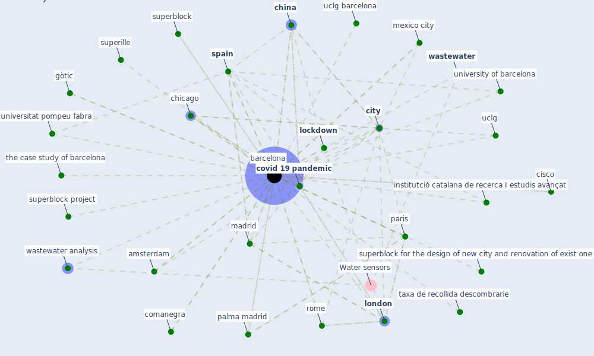

# Keyword: barcelona

## Keywords

 * amsterdam, arquitecte de catalunya, [barcelona](keyword_barcelona), barcelonaintrodueix, baro f, case study, case study of barcelona, chicago, [china](keyword_china), cisco, [city](keyword_city), col legi d arquitecte de catalunya, collegi d arquitecte de catalunya, comanegra, [covid 19 pandemic](keyword_covid_19_pandemic), edifici z, gòtic, gòtic neighborhood, institció catalana de recerca I estudis avançat, institutció catalana de recerca I estudis avançat, [lockdown](keyword_lockdown), [london](keyword_london), madrid, mexico city, palma madrid, paris, [rome](keyword_rome), rueda, [spain](keyword_spain), superblock, superblock for the design of new city and renovation of exist one, superblock project, superille, taxa de recollida descombrarie, the case study of barcelona, uclg, uclg barcelona, universitat pompeu fabra, university of barcelona, [wastewater](keyword_wastewater), wastewater analysis, zona franca

## Mapping

## Neighbours

### Closest articles

* The Impact of COVID-19 on Public Space: A Review of the Emerging Questions - [LINK](article_honey-roses_impact_2020)
* The COVID-19 pandemic: Impacts on cities and major lessons for urban planning, design, and management - [LINK](article_sharifi_covid-19_2020)
* Detection of SARS-CoV-2 in raw and treated wastewater in Germany – Suitability for COVID-19 surveillance and potential transmission risks - [LINK](article_westhaus_detection_2021)
* Urban planning after COVID-19 - [LINK](article_rtpi_urban_2021)
* An environmental and health perspective for COVID-19 outbreak: Meteorology and air quality influence, sewage epidemiology indicator, hospitals disinfection, drug therapies and recommendations - [LINK](article_barcelo_environmental_2020)
* Attitudes towards outdoor and neighbour noise during the COVID-19 lockdown: A case study in London - [LINK](article_lee_attitudes_2021)
* When the fourth water and digital revolution encountered COVID-19 - [LINK](article_poch_when_2020)
* Nurture to nature via COVID-19, a self-regenerating environmental strategy of environment in global context - [LINK](article_paital_nurture_2020)
* Challenges of data sharing in European Covid-19 projects: A learning opportunity for advancing pandemic preparedness and response - [LINK](article_tacconelli_challenges_2022)
* Sustainable work throughout the life course: National policies and strategies, Publications Office of the European Union - [LINK](article_eurofund_sustainable_2016)

### Closest BPs

