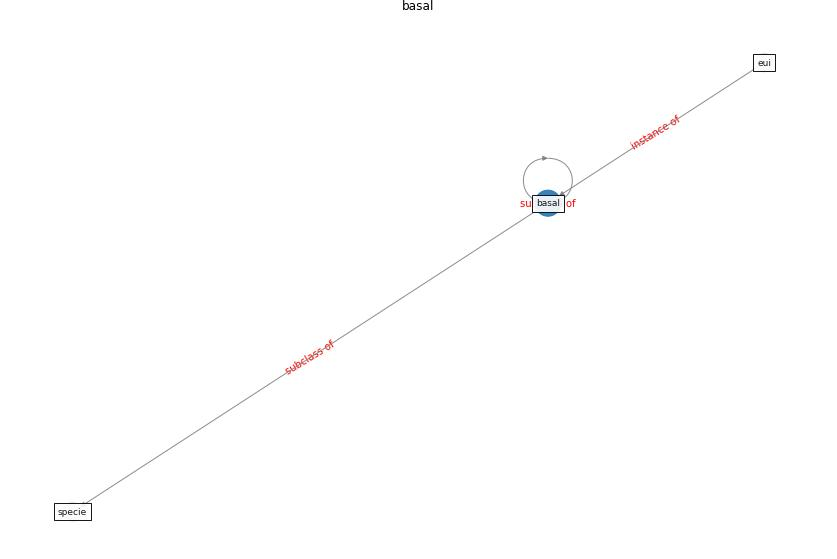

# Keyword: __basal__
## Clusters

* Cluster 0: [energy-building](cluster_0)

## Concepts

 

## Top 10 articles for __basal__
* Addressing the impact of COVID-19 lockdown on energy use
in municipal buildings: A case study in Florianópolis,
Brazil ([geraldi_addressing_2021](article_geraldi_addressing_2021))
* RUDDS_bioRxiv_update ([RUDDS_bioRxiv_update](article_RUDDS_bioRxiv_update))
* Mobility Behaviour in View of the Impact of the
COVID-19 Pandemic—Public Transport Users in
Gdansk Case Study ([przybylowski_mobility_2021](article_przybylowski_mobility_2021))
* Effects to Construction Project Management
Impacted Circular Economic of Covid-19 Pandemic ([paikan_effects_2021](article_paikan_effects_2021))
* Impacts of COVID-19 on Health and Safety of
Workforce in Construction Industry ([pamidimukkala_impacts_2021](article_pamidimukkala_impacts_2021))
* Health, Economic and Social Development Challenges
of the COVID-19 Pandemic: Strategies for Multiple
and Interconnected Issues ([panneer_health_2022](article_panneer_health_2022))
* COVID-19 Higher Mortality in Chinese Regions
With Chronic Exposure to Lower Air Quality ([pansini_covid-19_2021](article_pansini_covid-19_2021))
* Continuous IEQ monitoring system: Context and
development ([parkinson_continuous_2019](article_parkinson_continuous_2019))
* Assessment of Building Automation and Control
Systems in Danish Healthcare Facilities in the
COVID-19 Era ([pedersen_assessment_2022](article_pedersen_assessment_2022))
* How our homes impact our health: using a COVID-19
informed approach to examine urban apartment housing ([peters_how_2020](article_peters_how_2020))
