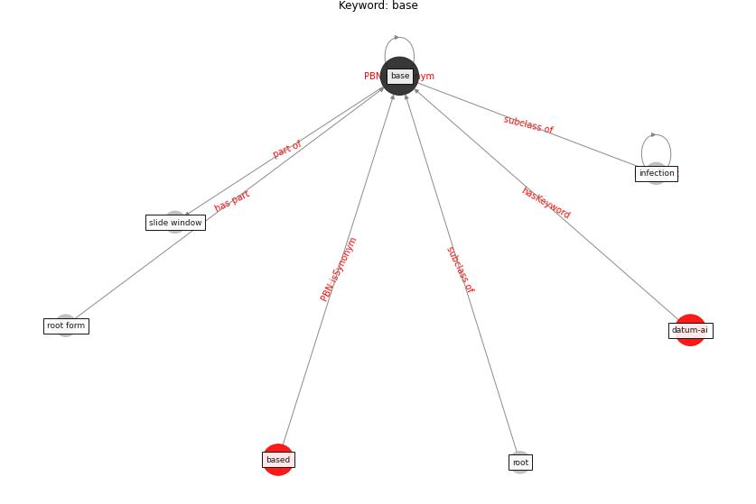

# Keyword: __base__
## Clusters

* Cluster 13: [blockchain-technology](cluster_13)
* Cluster 15: [ontology-datum](cluster_15)

## Concepts

 

## Articles
* Analysis of COVID-19 Concerns Raised by the
Construction Workforce and Development of
Mitigation Practices ([bou_hatoum_analysis_2021](article_bou_hatoum_analysis_2021))
* A Review on Building Design as a Biomedical
System for Preventing COVID-19 Pandemic ([amran_review_2022](article_amran_review_2022))
* RUDDS_bioRxiv_update ([RUDDS_bioRxiv_update](article_RUDDS_bioRxiv_update))
* DeepSOCIAL: Social Distancing Monitoring and
Infection Risk Assessment in COVID-19 Pandemic ([rezaei_deepsocial_2020](article_rezaei_deepsocial_2020))
* DeepSOCIAL: Social Distancing Monitoring and
Infection Risk Assessment in COVID-19 Pandemic ([rezaei_deepsocial_2020](article_rezaei_deepsocial_2020))
* DeepSOCIAL: Social Distancing Monitoring and
Infection Risk Assessment in COVID-19 Pandemic ([rezaei_deepsocial_2020](article_rezaei_deepsocial_2020))
* DeepSOCIAL: Social Distancing Monitoring and
Infection Risk Assessment in COVID-19 Pandemic ([rezaei_deepsocial_2020](article_rezaei_deepsocial_2020))
* DeepSOCIAL: Social Distancing Monitoring and
Infection Risk Assessment in COVID-19 Pandemic ([rezaei_deepsocial_2020](article_rezaei_deepsocial_2020))
* DeepSOCIAL: Social Distancing Monitoring and
Infection Risk Assessment in COVID-19 Pandemic ([rezaei_deepsocial_2020](article_rezaei_deepsocial_2020))
* DeepSOCIAL: Social Distancing Monitoring and
Infection Risk Assessment in COVID-19 Pandemic ([rezaei_deepsocial_2020](article_rezaei_deepsocial_2020))
