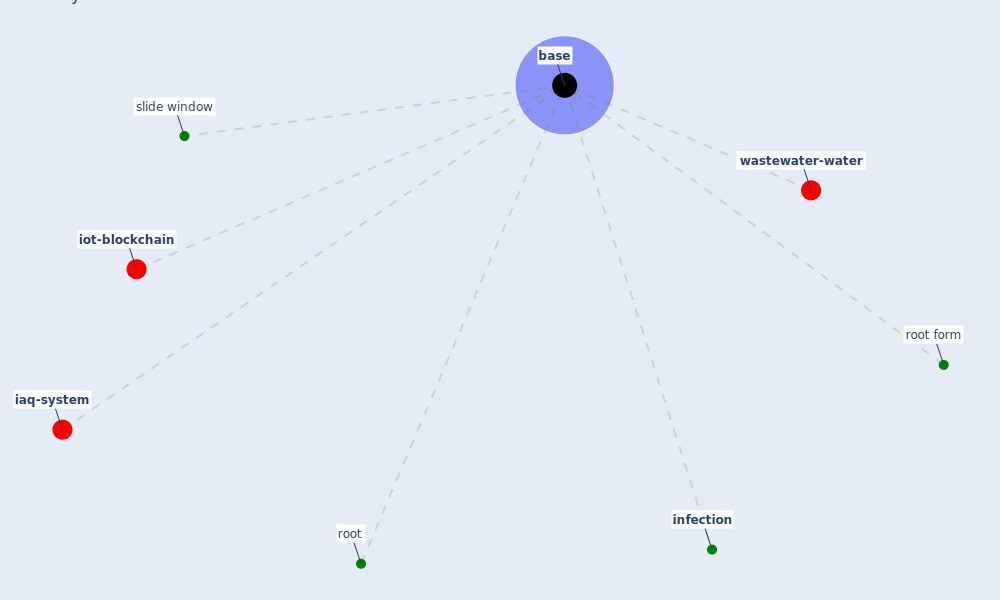

# Keyword: base

* [wastewater-water](cluster_0)

* [iot-blockchain](cluster_3)

* [iaq-system](cluster_7)

## Keywords

 * Cluster_0, Cluster_3, Cluster_7, [base](keyword_base), based, [infection](keyword_infection), root, root form, slide window

## Mapping

## Neighbours

### Closest articles

* Analysis of COVID-19 Concerns Raised by the Construction Workforce and Development of Mitigation Practices - [LINK](article_bou_hatoum_analysis_2021)
* First confirmed detection of SARS-CoV-2 in untreated wastewater in Australia: A proof of concept for the wastewater surveillance of COVID-19 in the community - [LINK](article_ahmed_first_2020)
* A Review on Building Design as a Biomedical System for Preventing COVID-19 Pandemic - [LINK](article_amran_review_2022)

### Closest BPs

