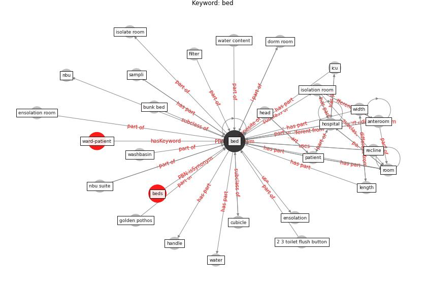

# Keyword: bed

* [ward-patient](cluster_Cluster_15)

## Keywords

 * 2 3 toilet flush button, Cluster_15, [anteroom](keyword_anteroom), [bed](keyword_bed), beds, bunk bed, cubicle, dorm room, ensolation, ensolation room, golden pothos, handle, head, [hospital](keyword_hospital), [icu](keyword_icu), isolate room, isolation room, length, nbu, nbu suite, [patient](keyword_patient), recline, [room](keyword_room), sampli, washbasin, [water](keyword_water), water content, width, filter

## Concepts

 

## Neighbours

### Closest articles

* A Global Survey of Infection Control and Mitigation Measures for Combating the Transmission of COVID-19 Pandemic in Buildings Under Facilities Management Services - [LINK](article_sarvari_global_2022)
* Toilets dominate environmental detection of SARS-CoV-2 virus in a hospital - [LINK](article_ding_toilets_2020)
* Characterization and performance evaluation of a full-scale activated carbon-based dynamic botanical air filtration system for improving indoor air quality - [LINK](article_wang_characterization_2011)
* Rapid expansion of temporary, reliable airborne-infection isolation rooms with negative air machines for critical COVID-19 patients - [LINK](article_lee_rapid_2020)
* Applications of ultraviolet germicidal irradiation disinfection in health care facilities: Effective adjunct, but not stand-alone technology - [LINK](article_memarzadeh_applications_2010)
* How the Coronavirus Will Reshape Architecture - [LINK](article_chayka_how_2020)
* SARS-CoV-2 RNA detection of hospital isolation wards hygiene monitoring during the Coronavirus Disease 2019 outbreak in a Chinese hospital - [LINK](article_wang_sars-cov-2_2020)

### Closest BPs

