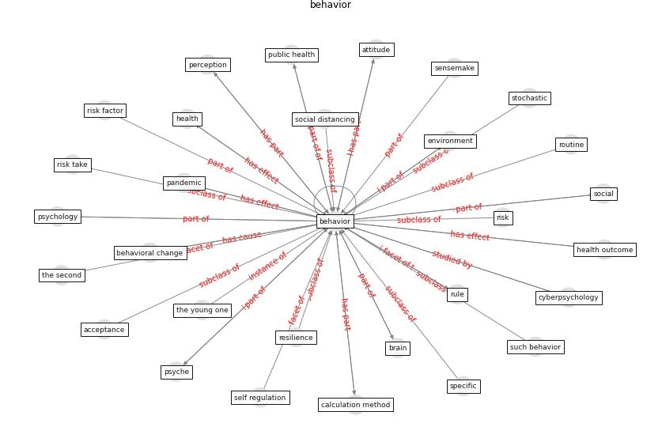

# Keyword: __behavior__
## Clusters

* Cluster 7: [tourism-tourist](cluster_7)

## Concepts

 

## Top 10 articles for __behavior__
* realdania_refleksioner_2022_EN ([realdania_refleksioner_2022_EN](article_realdania_refleksioner_2022_EN))
* The impacts of knowledge, risk perception, emotion and
information on citizens’ protective behaviors during the
outbreak of COVID-19: a cross-sectional study in
China ([ning_impacts_2020](article_ning_impacts_2020))
* How COVID-19 Could Accelerate the Adoption of
New Retail Technologies and Enhance the
(E-)Servicescape ([willems_how_2021](article_willems_how_2021))
* Compliance with COVID-19 Mitigation Measures in the
United States ([van_rooij_compliance_2020](article_van_rooij_compliance_2020))
* The Intelligent Lockdown: Compliance with COVID-19
Mitigation Measures in the Netherlands ([kuiper_intelligent_2020](article_kuiper_intelligent_2020))
* Should I Stay or Should I Go? Tourists’
COVID-19 Risk Perception and Vacation Behavior
Shift ([bratic_should_2021](article_bratic_should_2021))
* Treating two pandemics for the price of one: Chronic and
infectious disease impacts of the built and natural
environment ([frank_treating_2021](article_frank_treating_2021))
* Occupants’ behavior and activity patterns influencing
the energy consumption in the Kuwaiti residences ([al-mumin_occupants_2003](article_al-mumin_occupants_2003))
* COVID-19 and the UN Sustainable Development
Goals: Threat to Solidarity or an Opportunity? ([leal_filho_covid-19_2020](article_leal_filho_covid-19_2020))
* Home garden use during COVID-19: Associations with
physical and mental wellbeing in older adults ([corley_home_2021](article_corley_home_2021))
