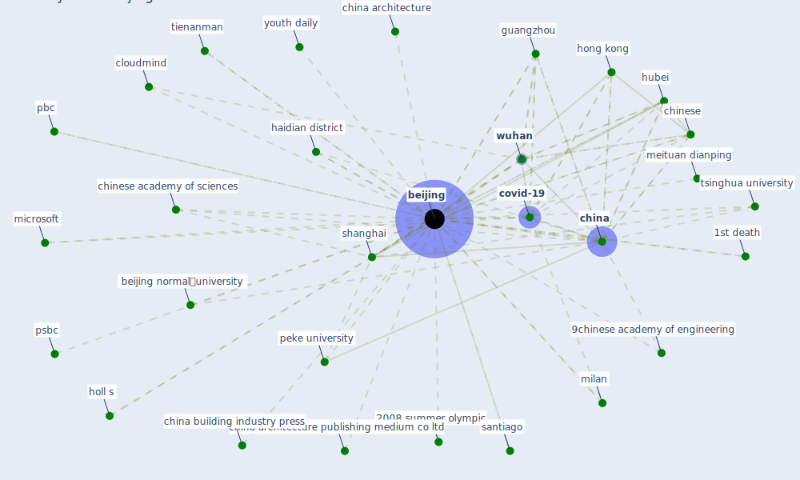

# Keyword: beijing

## Keywords

 * 14th world conference on earthquake engineering, 1st death, 2000 summer olympic, 2003 sar epidemic, 2008 summer olympic, 2012 summer olympic, 2016 summer olympic, 9chinese academy of engineering, academic press, academy of military science, ambient air pollution, [beijing](keyword_beijing), beijing normal工university, beijing youth daily, cai, center for disease prevention and control, [china](keyword_china), china architecture, china architecture building press, china architecture publishing medium co ltd, china building industry press, china construction industry press, china daily, china japan friendship hospital, [chinese](keyword_chinese), chinese academy of sciences, [city](keyword_city), cloudmind, covid 19 in beijing, covid 19 infection, covid 19 infection in beijing, [covid-19](keyword_covid-19), danny mu, dingblue technology, forrester, [gate](keyword_gate), gate village, gate village in beijing, guangzhou, haidian, haidian district, haze, health wellbeing productivity in office 57 microsoft, holl s, holl s link hybrid, [hong kong](keyword_hong_kong), [hubei](keyword_hubei), institute of microbiology and epidemiology, institute of technology bit, life sciences institute, linkingme, make in china 2025, massive public health crisis, meituan dianping, microsoft, microsoft modc, [milan](keyword_milan), [news](keyword_news), [pandemic](keyword_pandemic), pbc, peke university, post crisis housing bubble, [province](keyword_province), psbc, santiago, severe smog event, [shanghai](keyword_shanghai), smog event, standard press, standards press of china, the internet and the space time flexibility of daily activities, tienanman, [toronto](keyword_toronto), trinh hanoi, tsinghua university, urban heat island, urban park, weather beijing, white rhino auto company, world economic forum, [wtp](keyword_wtp), [wuhan](keyword_wuhan), youkang hengyebiotechnology, youth daily, zhao

## Mapping

## Neighbours

### Closest articles

* World Bank Development Report - [LINK](article_world_bank_world_2022)
* Toilets dominate environmental detection of SARS-CoV-2 virus in a hospital - [LINK](article_ding_toilets_2020)
* How COVID-19 Could Accelerate the Adoption of New Retail Technologies and Enhance the (E-)Servicescape - [LINK](article_willems_how_2021)
* An investigation of transmission control measures during the first 50 days of the COVID-19 epidemic in China - [LINK](article_tian_investigation_2020)
* A Comprehensive Review of the COVID-19 Pandemic and the Role of IoT, Drones, AI, Blockchain, and 5G in Managing its Impact - [LINK](article_chamola_comprehensive_2020)
* Climate and the spread of COVID-19 - [LINK](article_chen_climate_2021)
* Aerosol and Surface Distribution of Severe Acute Respiratory Syndrome Coronavirus 2 in Hospital Wards, Wuhan, China, 2020 - [LINK](article_guo_aerosol_2020)
* An Intelligent IEQ Monitoring and Feedback System: Development and Applications - [LINK](article_geng_intelligent_2021)
* Drones. Disinfecting robots. Supercomputers. The coronavirus outbreak is a test for China's tech industry \textbar CNN Business - [LINK](article_wang_drones_2020)
* Health, Wellbeing \& Productivity in Offices - [LINK](article_world_green_building_council_health_2014)

### Closest BPs

