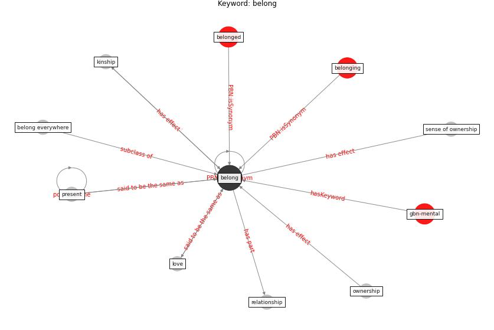

# Keyword: belong

* [gbn-mental](cluster_Cluster_0)

## Keywords

 * Cluster_0, [belong](keyword_belong), belong everywhere, belonged, belonging, kinship, love, ownership, present, relationship, sense of ownership

## Concepts

 

## Neighbours

### Closest articles

* How the Coronavirus Will Reshape Architecture - [LINK](article_chayka_how_2020)
* How COVID-19 Could Accelerate the Adoption of New Retail Technologies and Enhance the (E-)Servicescape - [LINK](article_willems_how_2021)
* Prophylactic Architecture: Formulating the Concept of Pandemic-Resilient Homes - [LINK](article_elrayies_prophylactic_2022)
* Coronavirus questions that will not go away: interrogating urban and socio-spatial implications of COVID-19 measures - [LINK](article_salama_coronavirus_2020)

### Closest BPs

