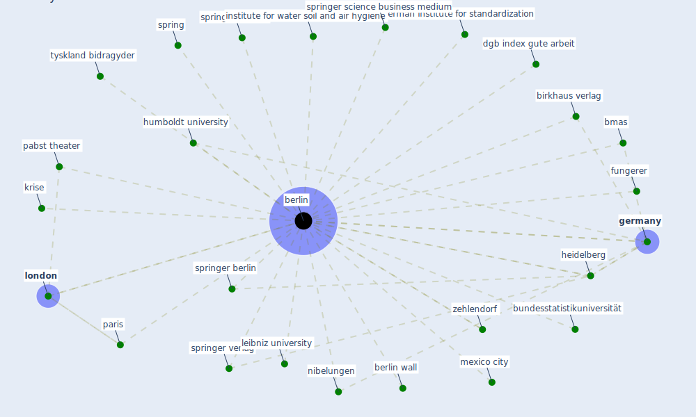

# Keyword: berlin

## Keywords

 * [berlin](keyword_berlin), berlin wall, birkhaus verlag, bmas, bundesstatistikuniversität, dgb index gute arbeit, fungerer, german institute for standardization, [germany](keyword_germany), heidelberg, humboldt university, institute for water soil and air hygiene, krise, leibniz university, [london](keyword_london), mexico city, nibelungen, pabst theater, paris, spring, springer berlin, springer science, springer science business medium, springer verlag, tyskland bidragyder, zehlendorf

## Mapping

## Neighbours

### Closest articles

* Impact of COVID-19 on IoT Adoption in Healthcare, Smart Homes, Smart Buildings, Smart Cities, Transportation and Industrial IoT - [LINK](article_umair_impact_2021)
* COVID-19 Could Leverage a Sustainable Built Environment - [LINK](article_pinheiro_covid-19_2020)
* How COVID-19 Could Accelerate the Adoption of New Retail Technologies and Enhance the (E-)Servicescape - [LINK](article_willems_how_2021)
* The socio-economic determinants of COVID-19: A spatial analysis of German county level data - [LINK](article_ehlert_socio-economic_2021)
* Analysis of COVID-19 Concerns Raised by the Construction Workforce and Development of Mitigation Practices - [LINK](article_bou_hatoum_analysis_2021)
* Refleksioner fra en pandemi - [LINK](article_realdania_refleksioner_2022)
* Urban Community Sustainable Development Patterns under the Influence of COVID-19: A Case Study Based on the Non-Contact Interaction Perspective of Hangzhou City - [LINK](article_wang_urban_2021)
* How COVID-19 Redefines the Concept of Sustainability - [LINK](article_hakovirta_how_2020)
* Designing for COVID-2x: Reflecting on Future-Proofing Human Habitation for the Inevitable Next Pandemic - [LINK](article_spennemann_designing_2022)
* Rotating groups at work, school best against COVID-19 spread: Study - [LINK](article_afp_rotating_2021)

### Closest BPs

