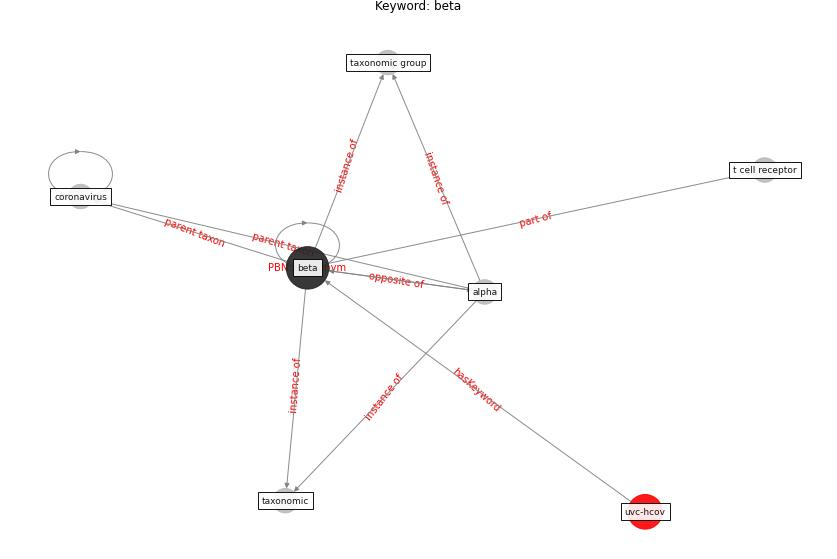

# Keyword: beta

* [uvc-hcov](cluster_Cluster_7)

## Keywords

 * Cluster_7, alpha, [beta](keyword_beta), [coronavirus](keyword_coronavirus), t cell receptor, taxonomic, taxonomic group

## Concepts

 

## Neighbours

### Closest articles

* Architectural Design Drives the Biogeography of Indoor Bacterial Communities - [LINK](article_kembel_architectural_2014)
* Covid-19 and asset management in EU: a preliminary assessment of performance and investment styles - [LINK](article_rizvi_covid-19_2020)
* Far-UVC light (222 nm) efficiently and safely inactivates airborne human coronaviruses - [LINK](article_buonanno_far-uvc_2020)
* Pandemic Analytics: How Countries are Leveraging Big Data Analytics and Artificial Intelligence to Fight COVID-19? - [LINK](article_mehta_pandemic_2021)

### Closest BPs

