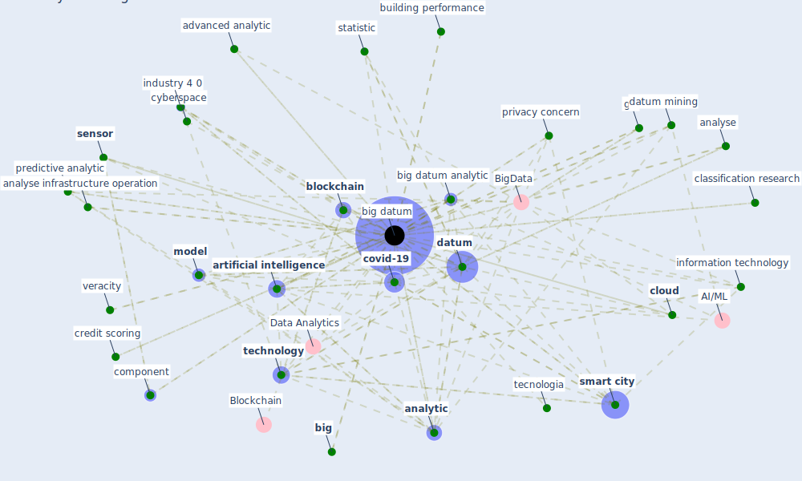

# Keyword: big datum

## Keywords

 * 3 big datum define big datum, BigData, Data Analytics, administrative datum, advanced analytic, alternative, analyse, analyse infrastructure operation, [analytic](keyword_analytic), analytical, [artificial intelligence](keyword_artificial_intelligence), [australia](keyword_australia), [big](keyword_big), big data, [big datum](keyword_big_datum), big datum analytic, big datum technique, biomedical, [blockchain](keyword_blockchain), building performance, challenge, challenge and opportunity with big datum, chris andersen, chris andersen s, classification research, [cloud](keyword_cloud), cloud computing, cloud datum processing, communication technology, component, control the virus spread, [covid-19](keyword_covid-19), credit scoring, cyberspace, [dataset](keyword_dataset), datashield, [datum](keyword_datum), datum acquisition, datum analysis, datum analytic, datum mining, datum overload, [datum sharing](keyword_datum_sharing), discrimination, estimation, [expert system](keyword_expert_system), fight against covid19, five v s, five v s of big datum, [font](keyword_font), gis, [healthcare](keyword_healthcare), [ieq](keyword_ieq), industry 4 0, [information](keyword_information), information and communication technology, information distribution, information technology, [intelligence](keyword_intelligence), intelligent system, [internet of thing](keyword_internet_of_thing), interpretation, [iot](keyword_iot), iot sensor, kocyigit, [machine learning](keyword_machine_learning), mine, [mining](keyword_mining), misuse, misuse and voguish nature, [model](keyword_model), model study, narrative, [ontology](keyword_ontology), [organization](keyword_organization), predictive analytic, privacy concern, semantic web, semantic web service, [sensor](keyword_sensor), [smart city](keyword_smart_city), [smartphone](keyword_smartphone), [society](keyword_society), statistic, study in big datum, [survey](keyword_survey), [sustainability](keyword_sustainability), [taiwan](keyword_taiwan), tech firm, [technology](keyword_technology), tecnologia, the iot for smart sustainable city of the future, [transport](keyword_transport), use of big datum, veracity, what be big datum

## Mapping

## Neighbours

### Closest articles

* Pandemic Analytics: How Countries are Leveraging Big Data Analytics and Artificial Intelligence to Fight COVID-19? - [LINK](article_mehta_pandemic_2021)
* Continuous IEQ monitoring system: Context and development - [LINK](article_parkinson_continuous_2019)
* World Bank Development Report - [LINK](article_world_bank_world_2022)
* The Emergence of Anti-Privacy and Control at the Nexus between the Concepts of Safe City and Smart City - [LINK](article_allam_emergence_2019)
* Impact of COVID-19 on IoT Adoption in Healthcare, Smart Homes, Smart Buildings, Smart Cities, Transportation and Industrial IoT - [LINK](article_umair_impact_2021)
*  - [LINK](article_mehtab_alam_role_2021)
* Design COVID-19 Ontology: A Healthcare and Safety Perspective - [LINK](article_aloulou_design_2022)
* How the 5G Enabled the COVID-19 Pandemic Prevention and Control: Materiality, Affordance, and (De-)Spatialization - [LINK](article_li_how_2022)
* An Overview of Ontologies and Tool Support for COVID-19 Analytics - [LINK](article_ahmad_overview_2021)
* Leveraging Digital Transformation Technologies to Tackle COVID-19: Proposing a Privacy-First Holistic Framework - [LINK](article_arpaci_leveraging_2021)

### Closest BPs

