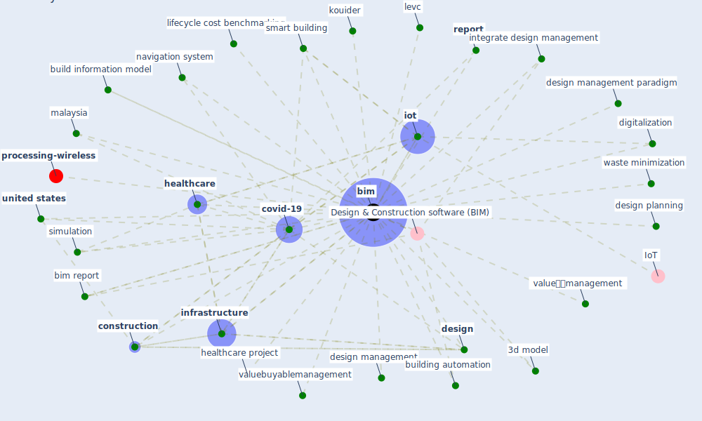

# Keyword: bim

* [processing-wireless](cluster_14)

## Keywords

 * 3d model, Cluster_14, Design & Construction software (BIM), augmented reality, [bim](keyword_bim), bim report, [build](keyword_build), build industry, build information model, building automation, building automation system, building component, [construction](keyword_construction), [covid-19](keyword_covid-19), [design](keyword_design), design management, design management paradigm, design planning, designer, digitalization, [healthcare](keyword_healthcare), healthcare project, [infrastructure](keyword_infrastructure), integrate design management, [iot](keyword_iot), kouider, levc, lifecycle cost benchmarking, [malaysia](keyword_malaysia), navigation system, [report](keyword_report), [simulation](keyword_simulation), [smart building](keyword_smart_building), [united states](keyword_united_states), valuebuyablemanagement, valueークmanagement, waste minimization

## Mapping

## Neighbours

### Closest articles

* Propositions for a Resilient, Post-COVID-19 Future for the AEC Industry - [LINK](article_nassereddine_propositions_2021)
* Emergency Healthcare Facilities: Managing Design in a Post Covid-19 World - [LINK](article_marinelli_emergency_2020)
* Overcoming the Impact of COVID-19 Using Integrated Project Delivery Model - [LINK](article_g_overcoming_2020)
* A review of facilities management interventions to mitigate respiratory infections in existing buildings - [LINK](article_zhang_review_2022)
* Guidelines for Responding to COVID-19 Pandemic: Best Practices, Impacts, and Future Research Directions - [LINK](article_assaad_guidelines_2021)
* Assessment of Building Automation and Control Systems in Danish Healthcare Facilities in the COVID-19 Era - [LINK](article_pedersen_assessment_2022)
* Revisiting the built environment: 10 potential development changes and paradigm shifts due to COVID-19 - [LINK](article_cheshmehzangi_revisiting_2021)
* Mechanisms for addressing the impact of COVID-19 on infrastructure projects - [LINK](article_king_mechanisms_2021)

### Closest BPs

