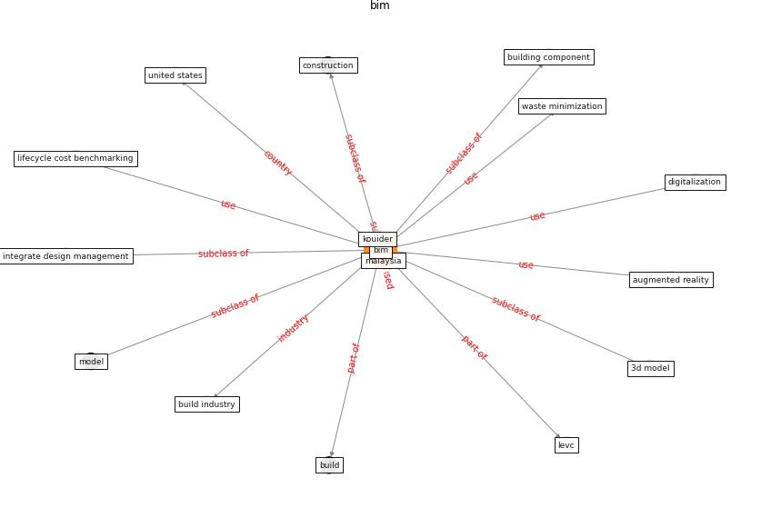

# Keyword: __bim__
## Clusters

* Cluster 2: [construction-resilience](cluster_2)

## Concepts

 

## Articles
* nassereddine_propositions_2021-150 ([nassereddine_propositions_2021-150](article_nassereddine_propositions_2021-150))
* Overcoming the Impact of COVID-19 Using Integrated
Project Delivery Model ([g_overcoming_2020](article_g_overcoming_2020))
* nassereddine_propositions_2021-300 ([nassereddine_propositions_2021-300](article_nassereddine_propositions_2021-300))
* Revisiting the built environment: 10 potential development
changes and paradigm shifts due to COVID-19 ([cheshmehzangi_revisiting_2021](article_cheshmehzangi_revisiting_2021))
* Mechanisms for addressing the impact of COVID-19 on
infrastructure projects ([king_mechanisms_2021](article_king_mechanisms_2021))
* realdania_refleksioner_2022_EN-3500 ([realdania_refleksioner_2022_EN-3500](article_realdania_refleksioner_2022_EN-3500))
* nassereddine_propositions_2021-200 ([nassereddine_propositions_2021-200](article_nassereddine_propositions_2021-200))
* realdania_refleksioner_2022_EN-1300 ([realdania_refleksioner_2022_EN-1300](article_realdania_refleksioner_2022_EN-1300))
* realdania_refleksioner_2022_EN-150 ([realdania_refleksioner_2022_EN-150](article_realdania_refleksioner_2022_EN-150))
* realdania_refleksioner_2022_EN-1450 ([realdania_refleksioner_2022_EN-1450](article_realdania_refleksioner_2022_EN-1450))
