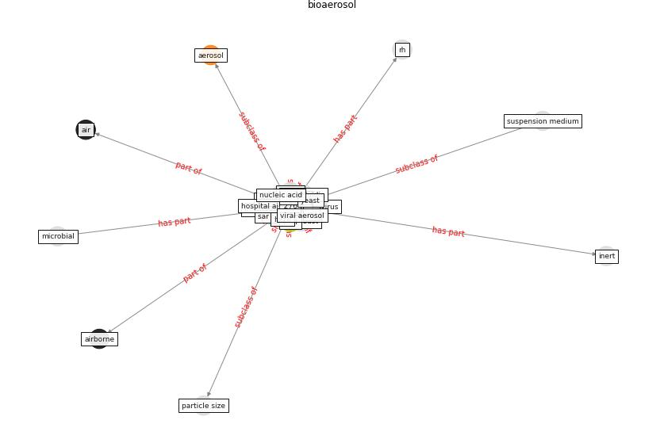

# Keyword: bioaerosol

* [perpetuity-bioaerosol](cluster_Cluster_3)

## Keywords

 * Cluster_3, [aerosol](keyword_aerosol), [air](keyword_air), air filtration, air sampler, [bioaerosol](keyword_bioaerosol), bioaerosols, build dust, [detection](keyword_detection), fungal, haze, inert, [infectious disease](keyword_infectious_disease), infectious virus, [influenza](keyword_influenza), microbial, microfluidic, nucleic acid, [particle](keyword_particle), particle size, [pathogen](keyword_pathogen), rh, [sar cov 2](keyword_sar_cov_2), stacked bar chart, ventilationtechnique, [viral](keyword_viral), yeast

## Concepts

 

## Neighbours

### Closest articles

* The removal of airborne SARS-CoV-2 and other microbial bioaerosols by air filtration on COVID-19 surge units - [LINK](article_conway-morris_removal_2021)
* Applications of ultraviolet germicidal irradiation disinfection in health care facilities: Effective adjunct, but not stand-alone technology - [LINK](article_memarzadeh_applications_2010)
* Effect of Ultraviolet Germicidal Irradiation on Viral Aerosols - [LINK](article_walker_effect_2007)
* A critical review of heating, ventilation, and air conditioning (HVAC) systems within the context of a global SARS-CoV-2 epidemic - [LINK](article_elsaid_critical_2021)
* Environmental factors involved in SARS-CoV-2 transmission: effect and role of indoor environmental quality in the strategy for COVID-19 infection control - [LINK](article_azuma_environmental_2020)
* Methods for air cleaning and protection of building occupants from airborne pathogens - [LINK](article_bolashikov_methods_2009)
* Architectural Design Drives the Biogeography of Indoor Bacterial Communities - [LINK](article_kembel_architectural_2014)
* A review of facilities management interventions to mitigate respiratory infections in existing buildings - [LINK](article_zhang_review_2022)
* COVID-19 Pandemic: Prevention and Protection Measures to Be Adopted at the Workplace - [LINK](article_cirrincione_covid-19_2020)

### Closest BPs

