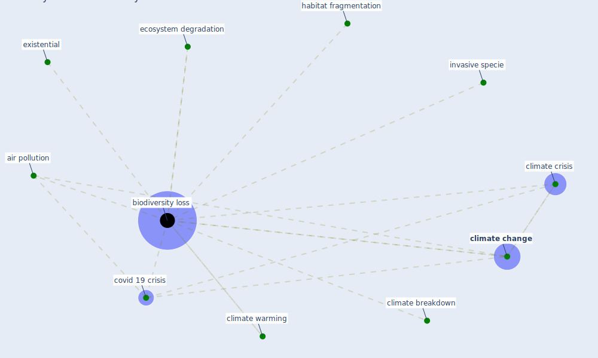

# Keyword: biodiversity loss

## Keywords

 * [air pollution](keyword_air_pollution), [biodiversity loss](keyword_biodiversity_loss), climate breakdown, [climate change](keyword_climate_change), climate crisis, climate warming, [covid 19 crisis](keyword_covid_19_crisis), ecosystem degradation, existential, habitat fragmentation, invasive specie

## Mapping

## Neighbours

### Closest articles

* Building up an ecologically sustainable and socially desirable post-COVID-19 future - [LINK](article_duflot_building_2021)
* Navigating Climate Change: Rethinking the Role of Buildings - [LINK](article_cole_navigating_2020)
* Biophilic design in architecture and its contributions to health, well-being, and sustainability: A critical review - [LINK](article_zhong_biophilic_2022)
* COVID-19 Higher Mortality in Chinese Regions With Chronic Exposure to Lower Air Quality - [LINK](article_pansini_covid-19_2021)
* Urban planning after COVID-19 - [LINK](article_rtpi_urban_2021)
* Learning from pandemics: Applying resilience thinking to identify priorities for planning urban settlements - [LINK](article_syal_learning_2021)

### Closest BPs

