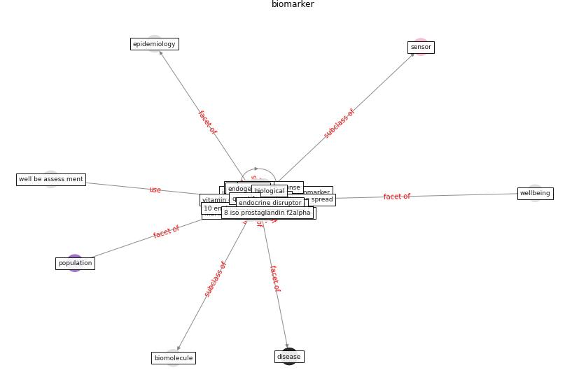

# Keyword: biomarker

* [wastewater-sars](cluster_Cluster_2)

## Keywords

 * 10 environment international, 8 iso prostaglandin f2alpha, Cluster_2, antibiotic resistance gene, arrhenius equation, biological, [biomarker](keyword_biomarker), biomarker of exposure, biomarkers, biomolecule, [biosensor](keyword_biosensor), cortisol, cortisol secretion, cotinine, covid 19 outbreak, [covid-19](keyword_covid-19), [disease](keyword_disease), elevate, elisa, endocrine disruptor, endogenous, [epidemiological](keyword_epidemiological), [epidemiology](keyword_epidemiology), exogenous, [exposure](keyword_exposure), [health](keyword_health), identified, inflammation, inflammatory damage, inflammatory response, inflammatory response biomarker, isoprostane, metabolic, monitor infectious disease spread, orm, oxidative stress, [population](keyword_population), proptoype, proteomic, quantify, salivary, [sar cov 2](keyword_sar_cov_2), [sensor](keyword_sensor), urinary, urinary biomarker, urine ip 10, vitamin d bind protein, [well be](keyword_well_be), well be assess ment

## Concepts

 

## Neighbours

### Closest articles

* Future perspectives of wastewater-based epidemiology: Monitoring infectious disease spread and resistance to the community level - [LINK](article_sims_future_2020)
* Wastewater-Based Epidemiology to monitor COVID-19 outbreak: Present and future diagnostic methods to be in your radar - [LINK](article_barcelo_wastewater-based_2020)
* Wastewater surveillance for population-wide Covid-19: The present and future - [LINK](article_daughton_wastewater_2020)
* Computational analysis of SARS-CoV-2/COVID-19 surveillance by wastewater-based epidemiology locally and globally: Feasibility, economy, opportunities and challenges - [LINK](article_hart_computational_2020)
* Ten questions concerning occupant health in buildings during normal operations and extreme events including the COVID-19 pandemic - [LINK](article_awada_ten_2021)
* COVID-19 Lockdown: Housing Built Environment’s Effects on Mental Health - [LINK](article_amerio_covid-19_2020)
* Occupant health in buildings: Impact of the COVID-19 pandemic on the opinions of building professionals and implications on research - [LINK](article_awada_occupant_2022)
* Detection of SARS-CoV-2 in raw and treated wastewater in Germany – Suitability for COVID-19 surveillance and potential transmission risks - [LINK](article_westhaus_detection_2021)
* SARS-CoV-2 RNA in wastewater anticipated COVID-19 occurrence in a low prevalence area - [LINK](article_randazzo_sars-cov-2_2020)

### Closest BPs

