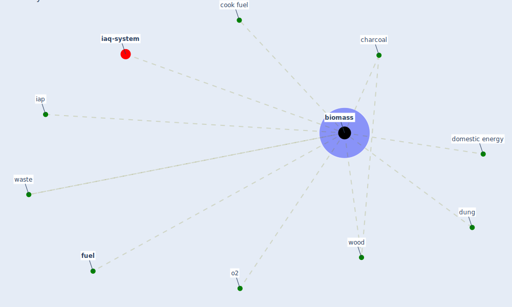

# Keyword: biomass

* [iaq-system](cluster_3)

## Keywords

 * Cluster_3, [biomass](keyword_biomass), charcoal, cook fuel, domestic energy, dung, [fuel](keyword_fuel), iap, o2, waste, wood

## Mapping

## Neighbours

### Closest articles

* A comprehensive review on indoor air quality monitoring systems for enhanced public health - [LINK](article_saini_comprehensive_2020)
* Graphene-based nanomaterials as antimicrobial surface coatings: A parallel approach to restrain the expansion of COVID-19 - [LINK](article_ayub_graphene-based_2021)
* Indoor Air Quality: Rethinking rules of building design strategies in post-pandemic architecture - [LINK](article_megahed_indoor_2021)

### Closest BPs

