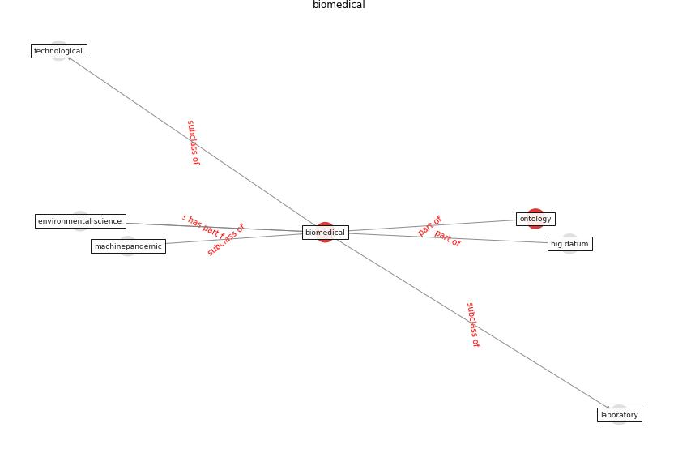

# Keyword: __biomedical__
## Clusters

* Cluster 15: [ontology-datum](cluster_15)

## Concepts

 

## Articles
* CIDO, a community-based ontology for coronavirus disease
knowledge and data integration, sharing, and analysis ([he_cido_2020](article_he_cido_2020))
* Upper-room ultraviolet air disinfection might help to
reduce COVID-19 transmission in buildings: a feasibility
study ([beggs_upper-room_2020](article_beggs_upper-room_2020))
* Disinfection technology of hospital wastes and wastewater:
Suggestions for disinfection strategy during coronavirus
Disease 2019 (COVID-19) pandemic in China ([wang_disinfection_2020](article_wang_disinfection_2020))
* An Overview of Biomedical Ontologies for Pandemics
and Infectious Diseases Representation ([bayoudhi_overview_2021](article_bayoudhi_overview_2021))
* Respiratory pandemics, urban planning and design: A
multidisciplinary rapid review of the literature ([harris_respiratory_2022](article_harris_respiratory_2022))
* Blockchain technology and its applications to combat
COVID-19 pandemic ([sharma_blockchain_2022](article_sharma_blockchain_2022))
* Applications of ultraviolet germicidal irradiation
disinfection in health care facilities: Effective
adjunct, but not stand-alone technology ([memarzadeh_applications_2010](article_memarzadeh_applications_2010))
* DeepSOCIAL: Social Distancing Monitoring and
Infection Risk Assessment in COVID-19 Pandemic ([rezaei_deepsocial_2020](article_rezaei_deepsocial_2020))
* DeepSOCIAL: Social Distancing Monitoring and
Infection Risk Assessment in COVID-19 Pandemic ([rezaei_deepsocial_2020](article_rezaei_deepsocial_2020))
* DeepSOCIAL: Social Distancing Monitoring and
Infection Risk Assessment in COVID-19 Pandemic ([rezaei_deepsocial_2020](article_rezaei_deepsocial_2020))
