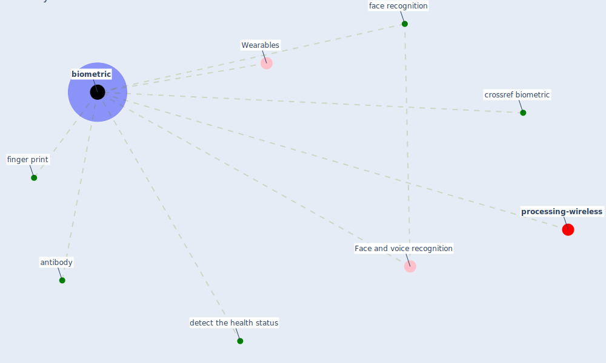

# Keyword: biometric

* [processing-wireless](cluster_14)

## Keywords

 * Cluster_14, Face and voice recognition, Wearables, antibody, [biometric](keyword_biometric), biometrics, crossref biometric, detect the health status, [face recognition](keyword_face_recognition), finger print

## Mapping

## Neighbours

### Closest articles

* 2020 Data Protection Report - [LINK](article_council_of_europe_2020_2020)
* COVID-19 Experience Transforming the Protective Environment of Office Buildings and Spaces - [LINK](article_phapant_covid-19_2021)
* COVID-19 and Green Housing: A Review of Relevant Literature - [LINK](article_kaklauskas_covid-19_2021)
* How COVID-19 Could Accelerate the Adoption of New Retail Technologies and Enhance the (E-)Servicescape - [LINK](article_willems_how_2021)

### Closest BPs

