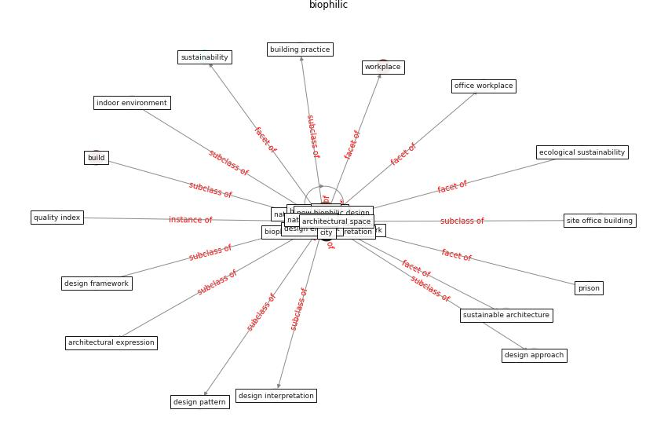

# Keyword: __biophilic__
## Clusters

* Cluster 8: [building-space](cluster_8)

## Concepts

 

## Articles
* Biophilic design in architecture and its contributions to
health, well-being, and sustainability: A critical
review ([zhong_biophilic_2022](article_zhong_biophilic_2022))
* world_green_building_council_health_2014 ([world_green_building_council_health_2014](article_world_green_building_council_health_2014))
* Indoor Air Quality: Rethinking rules of building
design strategies in post-pandemic architecture ([megahed_indoor_2021](article_megahed_indoor_2021))
* Occupant health in buildings: Impact of the COVID-19
pandemic on the opinions of building professionals and
implications on research ([awada_occupant_2022](article_awada_occupant_2022))
* Coronavirus questions that will not go away: interrogating
urban and socio-spatial implications of COVID-19
measures ([salama_coronavirus_2020](article_salama_coronavirus_2020))
* Association between indoor-outdoor green features and
psychological health during the COVID-19 lockdown in
Italy: A cross-sectional nationwide study ([spano_association_2021](article_spano_association_2021))
* Prophylactic Architecture: Formulating the Concept
of Pandemic-Resilient Homes ([elrayies_prophylactic_2022](article_elrayies_prophylactic_2022))
* How our homes impact our health: using a COVID-19
informed approach to examine urban apartment housing ([peters_how_2020](article_peters_how_2020))
* COVID-19 Higher Mortality in Chinese Regions
With Chronic Exposure to Lower Air Quality ([pansini_covid-19_2021](article_pansini_covid-19_2021))
* Continuous IEQ monitoring system: Context and
development ([parkinson_continuous_2019](article_parkinson_continuous_2019))
