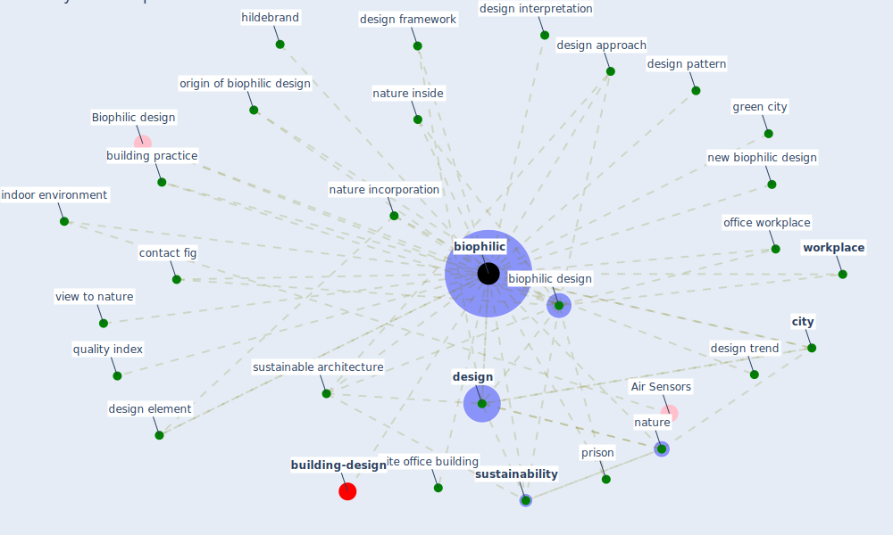

# Keyword: biophilic

* [building-design](cluster_5)

## Keywords

 * Biophilic design, Cluster_5, [biophilic](keyword_biophilic), biophilic city, [biophilic design](keyword_biophilic_design), biophilic design framework, biophilic design interpretation, biophilic indoor environment, [build](keyword_build), building practice, [city](keyword_city), contact fig, [design](keyword_design), design approach, design element, design framework, design interpretation, design pattern, design strategy, design trend, green city, hildebrand, [indoor environment](keyword_indoor_environment), [nature](keyword_nature), nature incorporation, nature inside, new biophilic design, office workplace, origin of biophilic design, prison, quality index, site office building, [sustainability](keyword_sustainability), [sustainable architecture](keyword_sustainable_architecture), view to nature, [workplace](keyword_workplace)

## Mapping

## Neighbours

### Closest articles

* Biophilic design in architecture and its contributions to health, well-being, and sustainability: A critical review - [LINK](article_zhong_biophilic_2022)
* Health, Wellbeing \& Productivity in Offices - [LINK](article_world_green_building_council_health_2014)
* Occupant health in buildings: Impact of the COVID-19 pandemic on the opinions of building professionals and implications on research - [LINK](article_awada_occupant_2022)
* Indoor Air Quality: Rethinking rules of building design strategies in post-pandemic architecture - [LINK](article_megahed_indoor_2021)
* Green in times of COVID-19: urban green space relevance during the COVID-19 pandemic in Buenos Aires City - [LINK](article_marconi_green_2022)
* Coronavirus questions that will not go away: interrogating urban and socio-spatial implications of COVID-19 measures - [LINK](article_salama_coronavirus_2020)
* Association between indoor-outdoor green features and psychological health during the COVID-19 lockdown in Italy: A cross-sectional nationwide study - [LINK](article_spano_association_2021)
* Prophylactic Architecture: Formulating the Concept of Pandemic-Resilient Homes - [LINK](article_elrayies_prophylactic_2022)

### Closest BPs

