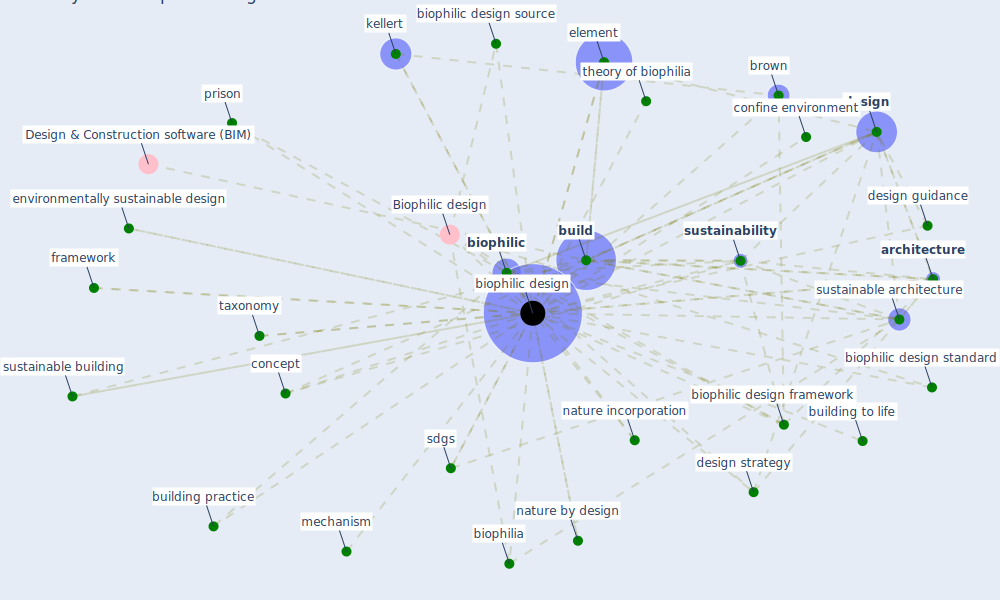

# Keyword: biophilic design

## Keywords

 * 4 three key framework of biophilic design, Biophilic design, all inclusiveness, approach, [architecture](keyword_architecture), benefit, biophilia, [biophilic](keyword_biophilic), [biophilic design](keyword_biophilic_design), biophilic design framework, biophilic design source, biophilic design standard, biophilic designed, biophilic designs, brown, [build](keyword_build), building certification system, building practice, building sector, building to life, [climate change](keyword_climate_change), concept, confine environment, contact fig, crave for nature, craving, criterion, [design](keyword_design), design approach, design approach and element, design guidance, design strategy, designer, element, environmentally sustainable design, example 5 1, experience of space and place, framework, green of architecture, grey literature, habitat, hea, [health](keyword_health), kellert, key design strategy, key framework, key interpretation, knowledge gap, landscape, mechanism, nature by design, nature connectedness, nature incorporation, nature inside, office workplace, origin of biophilic design, pilot experiment, [practice](keyword_practice), prison, ryan, [sdgs](keyword_sdgs), [sustainability](keyword_sustainability), [sustainable architecture](keyword_sustainable_architecture), sustainable architecture benefit of biophilic design, sustainable building, sustainable goal, taxonomy, theory of biophilia, unmeasurable benefit, urban architecture, [workplace](keyword_workplace)

## Mapping

## Neighbours

### Closest articles

* Biophilic design in architecture and its contributions to health, well-being, and sustainability: A critical review - [LINK](article_zhong_biophilic_2022)
*  - [LINK](article_dalessandro_covid-19_2020)
* Prophylactic Architecture: Formulating the Concept of Pandemic-Resilient Homes - [LINK](article_elrayies_prophylactic_2022)
* Occupant health in buildings: Impact of the COVID-19 pandemic on the opinions of building professionals and implications on research - [LINK](article_awada_occupant_2022)
* How our homes impact our health: using a COVID-19 informed approach to examine urban apartment housing - [LINK](article_peters_how_2020)
* Health, Wellbeing \& Productivity in Offices - [LINK](article_world_green_building_council_health_2014)

### Closest BPs

