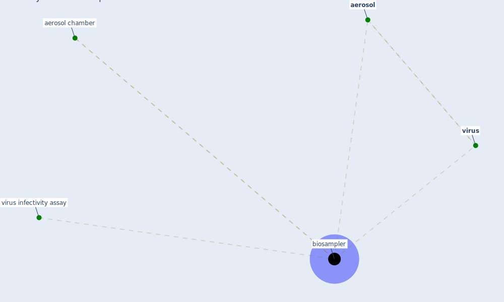

# Keyword: biosampler

## Keywords

 * [aerosol](keyword_aerosol), aerosol chamber, [biosampler](keyword_biosampler), [virus](keyword_virus), virus infectivity assay

## Mapping

## Neighbours

### Closest articles

* Far-UVC light (222 nm) efficiently and safely inactivates airborne human coronaviruses - [LINK](article_buonanno_far-uvc_2020)

### Closest BPs

