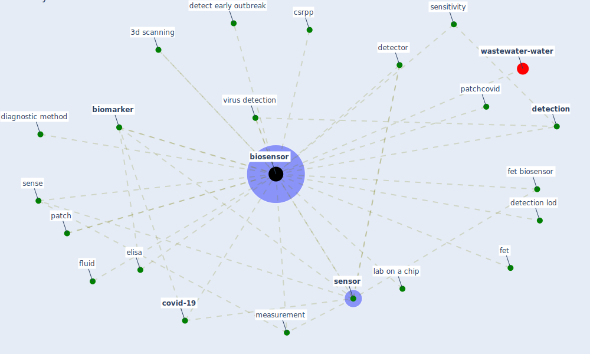

# Keyword: biosensor

* [wastewater-water](cluster_0)

## Keywords

 * 3d scanning, Cluster_0, [biomarker](keyword_biomarker), [biosensor](keyword_biosensor), biosensors, [covid-19](keyword_covid-19), csrpp, detect early outbreak, [detection](keyword_detection), detection lod, detector, diagnostic method, elisa, fet, fet biosensor, lab on a chip, measurement, patch, patchcovid, sense, sensitivity, [sensor](keyword_sensor), virus detection, fluid

## Mapping

## Neighbours

### Closest articles

* Wastewater-Based Epidemiology to monitor COVID-19 outbreak: Present and future diagnostic methods to be in your radar - [LINK](article_barcelo_wastewater-based_2020)
* A Comprehensive Review of the COVID-19 Pandemic and the Role of IoT, Drones, AI, Blockchain, and 5G in Managing its Impact - [LINK](article_chamola_comprehensive_2020)
* An environmental and health perspective for COVID-19 outbreak: Meteorology and air quality influence, sewage epidemiology indicator, hospitals disinfection, drug therapies and recommendations - [LINK](article_barcelo_environmental_2020)
* Designing Post COVID-19 Buildings: Approaches for Achieving Healthy Buildings - [LINK](article_navaratnam_designing_2022)
* Blockchain technology and its applications to combat COVID-19 pandemic - [LINK](article_sharma_blockchain_2022)
* Future perspectives of wastewater-based epidemiology: Monitoring infectious disease spread and resistance to the community level - [LINK](article_sims_future_2020)
* Impact of COVID-19 on IoT Adoption in Healthcare, Smart Homes, Smart Buildings, Smart Cities, Transportation and Industrial IoT - [LINK](article_umair_impact_2021)

### Closest BPs

