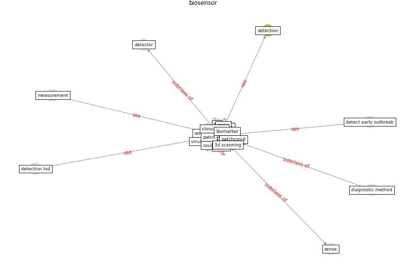

# Keyword: __biosensor__
## Clusters

* Cluster 12: [wastewater-sars](cluster_12.md)

## Concepts

 

## Articles
* A Comprehensive Review of the COVID-19 Pandemic
and the Role of IoT, Drones, AI, Blockchain, and
5G in Managing its Impact ([chamola_comprehensive_2020](article_chamola_comprehensive_2020.md))
* Wastewater-Based Epidemiology to monitor COVID-19
outbreak: Present and future diagnostic methods to be in
your radar ([barcelo_wastewater-based_2020](article_barcelo_wastewater-based_2020.md))
* Blockchain technology and its applications to combat
COVID-19 pandemic ([sharma_blockchain_2022](article_sharma_blockchain_2022.md))
* Future perspectives of wastewater-based epidemiology:
Monitoring infectious disease spread and resistance to
the community level ([sims_future_2020](article_sims_future_2020.md))
* Designing Post COVID-19 Buildings: Approaches for
Achieving Healthy Buildings ([navaratnam_designing_2022](article_navaratnam_designing_2022.md))
* Impact of COVID-19 on IoT Adoption in Healthcare,
Smart Homes, Smart Buildings, Smart Cities,
Transportation and Industrial IoT ([umair_impact_2021](article_umair_impact_2021.md))
* RUDDS_bioRxiv_update-0 ([RUDDS_bioRxiv_update-0](article_RUDDS_bioRxiv_update-0.md))
* realdania_refleksioner_2022_EN-1250 ([realdania_refleksioner_2022_EN-1250](article_realdania_refleksioner_2022_EN-1250.md))
* realdania_refleksioner_2022_EN-150 ([realdania_refleksioner_2022_EN-150](article_realdania_refleksioner_2022_EN-150.md))
* realdania_refleksioner_2022_EN-1450 ([realdania_refleksioner_2022_EN-1450](article_realdania_refleksioner_2022_EN-1450.md))
