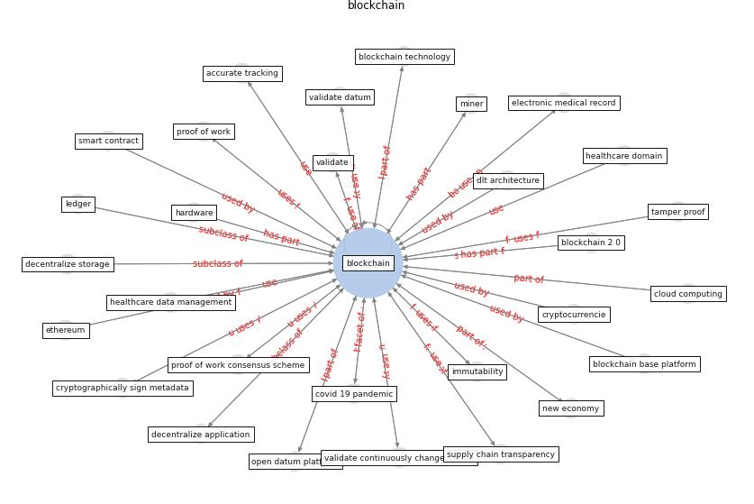

# Keyword: __blockchain__
## Clusters

* Cluster 1: [datum-health](cluster_1)

## Concepts

 

## Articles
* Blockchain technology and its applications to combat
COVID-19 pandemic ([sharma_blockchain_2022](article_sharma_blockchain_2022))
* A Comprehensive Review of the COVID-19 Pandemic
and the Role of IoT, Drones, AI, Blockchain, and
5G in Managing its Impact ([chamola_comprehensive_2020](article_chamola_comprehensive_2020))
* Health Information Exchange with Blockchain amid
Covid-19-like Pandemics ([christodoulou_health_2020](article_christodoulou_health_2020))
* Leveraging Digital Transformation Technologies to
Tackle COVID-19: Proposing a Privacy-First
Holistic Framework ([arpaci_leveraging_2021](article_arpaci_leveraging_2021))
* Contributions of Smart City Solutions and
Technologies to Resilience against the COVID-19
Pandemic: A Literature Review ([sharifi_contributions_2021](article_sharifi_contributions_2021))
* How Can Blockchain Help People in the Event of
Pandemics Such as the COVID-19? ([chang_how_2020](article_chang_how_2020))
* Impact of COVID-19 on IoT Adoption in Healthcare,
Smart Homes, Smart Buildings, Smart Cities,
Transportation and Industrial IoT ([umair_impact_2021](article_umair_impact_2021))
* The role of 5G for digital healthcare against COVID-19
pandemic: Opportunities and challenges ([siriwardhana_role_2021](article_siriwardhana_role_2021))
* Exploring the Potential of Artificial Intelligence
and Machine Learning to Combat COVID-19 and
Existing Opportunities for LMIC: A Scoping
Review ([naseem_exploring_2020](article_naseem_exploring_2020))
* Digital technology and COVID-19 ([ting_digital_2020](article_ting_digital_2020))
