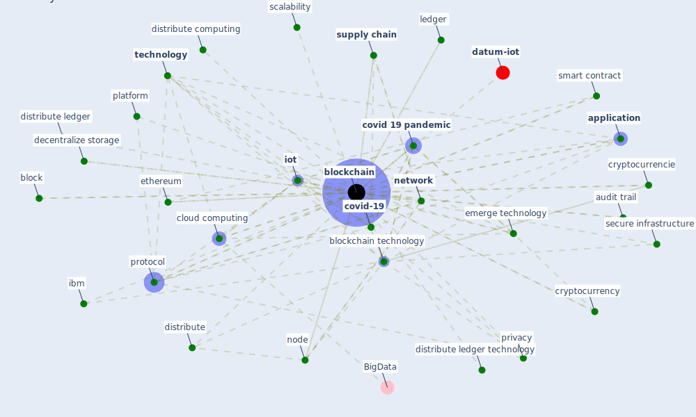

# Keyword: blockchain

* [iot-blockchain](cluster_7)

* [processing-wireless](cluster_14)

## Keywords

 * accurate tracking, [application](keyword_application), audit trail, [big datum](keyword_big_datum), block, [blockchain](keyword_blockchain), blockchain 2 0, [blockchain technology](keyword_blockchain_technology), cloud computing, [covid 19 pandemic](keyword_covid_19_pandemic), [covid-19](keyword_covid-19), crowdfunde, cryptocurrencie, cryptocurrency, cryptographically sign metadata, [datum](keyword_datum), [datum sharing](keyword_datum_sharing), decentralization, [decentralize](keyword_decentralize), decentralize application, decentralize solution, decentralize storage, distribute, distribute computing, distribute ledger, distribute ledger technology, distribute platform, dlt architecture, electronic device, emerge technology, [ethereum](keyword_ethereum), fintech, hardware, [healthcare](keyword_healthcare), healthcare data management, healthcare domain, healthcare protection, heterogeneous medicare datum, ibm, ids, immutability, incentive mechanism, infectious disease outbreak, innovative technology, interconnect network, [internet of thing](keyword_internet_of_thing), [iot](keyword_iot), iot node, iot security, lack of awareness, ledger, liyanage, [machine learning](keyword_machine_learning), medshare, metadata, micro transaction, miner, [network](keyword_network), network of user, new economy, [node](keyword_node), open datum platform, participate node, patient health record, permissione, [platform](keyword_platform), [privacy](keyword_privacy), proof of work, proof of work consensus scheme, [protocol](keyword_protocol), [public key](keyword_public_key), quantum cryptography, [robot](keyword_robot), scalability, secure, secure infrastructure, security concern, [smart contract](keyword_smart_contract), smart infrastructure, smart technology, smart wearable, software, [solution](keyword_solution), store datum, [supply chain](keyword_supply_chain), supply chain transparency, tamper proof, [technology](keyword_technology), token, traceable, track, transaction, transparency, trust tracking system, v2 g, [vaccine](keyword_vaccine), validate, validate continuously change datum, validate datum, yue x wang h jin d li m jiang w

## Mapping

## Neighbours

### Closest articles

* Blockchain technology and its applications to combat COVID-19 pandemic - [LINK](article_sharma_blockchain_2022)
* A Comprehensive Review of the COVID-19 Pandemic and the Role of IoT, Drones, AI, Blockchain, and 5G in Managing its Impact - [LINK](article_chamola_comprehensive_2020)
* Health Information Exchange with Blockchain amid Covid-19-like Pandemics - [LINK](article_christodoulou_health_2020)
* Contributions of Smart City Solutions and Technologies to Resilience against the COVID-19 Pandemic: A Literature Review - [LINK](article_sharifi_contributions_2021)
* Leveraging Digital Transformation Technologies to Tackle COVID-19: Proposing a Privacy-First Holistic Framework - [LINK](article_arpaci_leveraging_2021)
* How Can Blockchain Help People in the Event of Pandemics Such as the COVID-19? - [LINK](article_chang_how_2020)
* World Bank Development Report - [LINK](article_world_bank_world_2022)
* Impact of COVID-19 on IoT Adoption in Healthcare, Smart Homes, Smart Buildings, Smart Cities, Transportation and Industrial IoT - [LINK](article_umair_impact_2021)
* The role of 5G for digital healthcare against COVID-19 pandemic: Opportunities and challenges - [LINK](article_siriwardhana_role_2021)
* Future (post-COVID) digital, smart and sustainable cities in the wake of 6G: Digital twins, immersive realities and new urban economies - [LINK](article_allam_future_2021)

### Closest BPs

