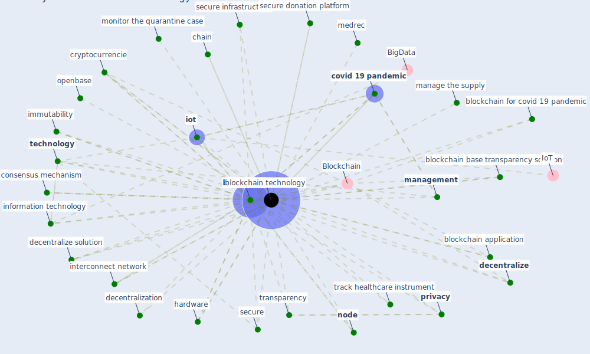

# Keyword: blockchain technology

## Keywords

 * Blockchain, acoer, anonymously and securely, [application](keyword_application), [blockchain](keyword_blockchain), blockchain application, blockchain base transparency solution, blockchain for covid 19 pandemic, blockchain technologies, [blockchain technology](keyword_blockchain_technology), blockchain technology subj bt, chain, consensus mechanism, contactless delivery, control the spread of this pandemic, [covid 19 pandemic](keyword_covid_19_pandemic), covid 19 pandemic re, cryptocurrencie, [datum](keyword_datum), decentralization, [decentralize](keyword_decentralize), decentralize solution, digitally datum storage, distribute, distribute check up point, distribute computer, distribute network, [government](keyword_government), hardware, hashlog, healthcare domain, healthcare industry, healthcare protection, healthcare provider, [healthcare system](keyword_healthcare_system), ibm, identify whether or not an event be true, immutability, infectious disease outbreak, information sharing, information technology, interconnect network, [iot](keyword_iot), manage the supply, [management](keyword_management), medrec, monitor the quarantine case, [node](keyword_node), openbase, pain management, patient traceability, preserve the patient information, [privacy](keyword_privacy), quantum cryptography, revolutionize credit, safeguard and exchange datum, secure, secure donation platform, secure infrastructure, [technology](keyword_technology), trace uninfected person movement, track healthcare instrument, tracking of person movement, transparency, transparent, trust

## Mapping

## Neighbours

### Closest articles

* Blockchain technology and its applications to combat COVID-19 pandemic - [LINK](article_sharma_blockchain_2022)
* A Comprehensive Review of the COVID-19 Pandemic and the Role of IoT, Drones, AI, Blockchain, and 5G in Managing its Impact - [LINK](article_chamola_comprehensive_2020)
* Leveraging Digital Transformation Technologies to Tackle COVID-19: Proposing a Privacy-First Holistic Framework - [LINK](article_arpaci_leveraging_2021)
* Health Information Exchange with Blockchain amid Covid-19-like Pandemics - [LINK](article_christodoulou_health_2020)
* World Bank Development Report - [LINK](article_world_bank_world_2022)
* How Can Blockchain Help People in the Event of Pandemics Such as the COVID-19? - [LINK](article_chang_how_2020)
* Construction of a Linked Data Set of COVID-19 Knowledge Graphs: Development and Applications - [LINK](article_wang_construction_2022)
* On the Coronavirus (COVID-19) Outbreak and the Smart City Network: Universal Data Sharing Standards Coupled with Artificial Intelligence (AI) to Benefit Urban Health Monitoring and Management - [LINK](article_allam_coronavirus_2020)
* Contributions of Smart City Solutions and Technologies to Resilience against the COVID-19 Pandemic: A Literature Review - [LINK](article_sharifi_contributions_2021)

### Closest BPs

