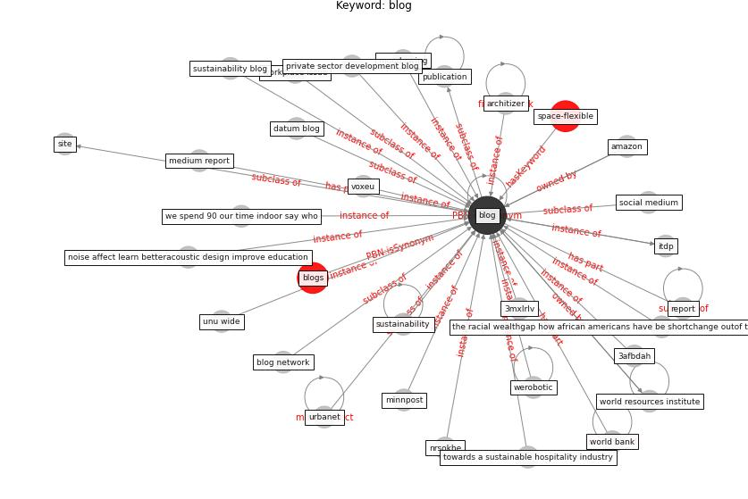

# Keyword: blog

* [space-flexible](cluster_Cluster_14)

## Keywords

 * 3afbdah, 3mxlrlv, Cluster_14, amazon, arcgis, architizer, blb, [blog](keyword_blog), blog network, blogs, blogs press, business law, business law blog, datum blog, divante, divante com, dpu, financial fraud blog, future development, ghada o, health affair, how datum and analy tic can help we combat covid 19, how uvc lighting can help make public gathering safe, huffington, insight, itdp, law blog, medium report, minnpost, mood swing, noise affect learn betteracoustic design improve education, nrsokhe, online resource, opendata, plan the world we need 64, press, private sector development, private sector development blog, psychology today, publication, report, [site](keyword_site), [social medium](keyword_social_medium), [sustainability](keyword_sustainability), sustainability blog, the racial wealthgap how african americans have be shortchange outof the material to build wealth 86, towards a sustainable hospitality industry, unu wide, unu wide blog, urbanet, venturebeat, vox, voxeu, we spend 90 our time indoor say who, werobotic, workplace issue, [world bank](keyword_world_bank), world resources institute

## Concepts

 

## Neighbours

### Closest articles

* World Bank Development Report - [LINK](article_world_bank_world_2022)
* Urban planning after COVID-19 - [LINK](article_rtpi_urban_2021)
* How COVID-19 Could Accelerate the Adoption of New Retail Technologies and Enhance the (E-)Servicescape - [LINK](article_willems_how_2021)
* Effects to Construction Project Management Impacted Circular Economic of Covid-19 Pandemic - [LINK](article_paikan_effects_2021)
* COVID-19 and the UN Sustainable Development Goals: Threat to Solidarity or an Opportunity? - [LINK](article_leal_filho_covid-19_2020)
* The COVID-19 pandemic: Lessons on building more equal and sustainable societies - [LINK](article_van_barneveld_covid-19_2020)
* Biophilic design in architecture and its contributions to health, well-being, and sustainability: A critical review - [LINK](article_zhong_biophilic_2022)
* The City Under COVID‐19: Podcasting As Digital Methodology - [LINK](article_rogers_city_2020)
* Learning from pandemics: Applying resilience thinking to identify priorities for planning urban settlements - [LINK](article_syal_learning_2021)
* Nurture to nature via COVID-19, a self-regenerating environmental strategy of environment in global context - [LINK](article_paital_nurture_2020)

### Closest BPs

