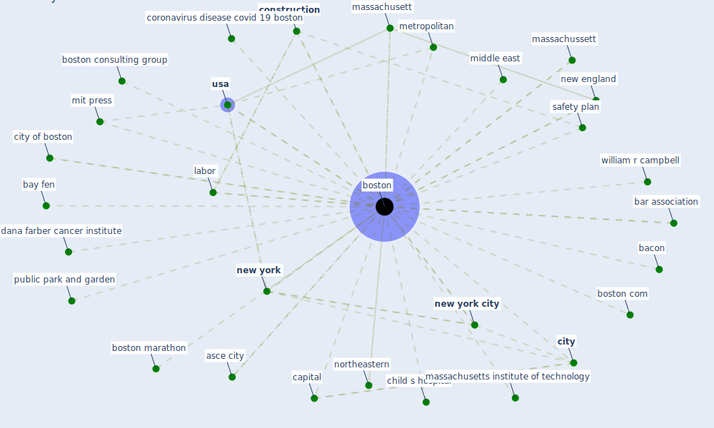

# Keyword: boston

## Keywords

 * 06021001 7 j manage, 0a161a6d 690f 49d5 937e 2432b87b0310 org, asce city, bacon, bar association, bay fen, [boston](keyword_boston), boston com, boston consulting group, boston marathon, boston plan, brigham and woman s hospital, brigham women s faulkner, brigham women s faulkner hospital, brigham women s hospital, butterworth heinemann, capital, chan school of public health, child s hospital, [city](keyword_city), city of boston, [construction](keyword_construction), construction boom, construction company, construction sector, [coronavirus](keyword_coronavirus), coronavirus concern, coronavirus disease covid 19 boston, dana farber cancer institute, franzese, houghton mifflin, housing market, labor, magazine, marathon, massachusett, massachusetts institute of technology, massachussett, mccourt construction, metropolitan, middle east, mit press, new england, [new york](keyword_new_york), [new york city](keyword_new_york_city), northeastern, public park and garden, safety plan, significant precipitation, [state](keyword_state), temporary guidance construction city boston, [united kingdom](keyword_united_kingdom), [usa](keyword_usa), whoop, william r campbell

## Mapping

## Neighbours

### Closest articles

* Guidelines for Responding to COVID-19 Pandemic: Best Practices, Impacts, and Future Research Directions - [LINK](article_assaad_guidelines_2021)
* Future (post-COVID) digital, smart and sustainable cities in the wake of 6G: Digital twins, immersive realities and new urban economies - [LINK](article_allam_future_2021)
* Respiratory pandemics, urban planning and design: A multidisciplinary rapid review of the literature - [LINK](article_harris_respiratory_2022)
* Assessment of COVID-19 precautionary measures in sports facilities: A case study on a health club in Saudi Arabia - [LINK](article_ibrahim_assessment_2022)
* Urban design attributes and resilience: COVID-19 evidence from New York City - [LINK](article_yang_urban_2021)
* Mechanistic insights into the effect of humidity on airborne influenza virus survival, transmission and incidence - [LINK](article_marr_mechanistic_2019)
* The COVID-19 epidemiology and monitoring ontology - [LINK](article_queralt-rosinach_covid-19_2021)
* Validity of energy social research during and after COVID-19: challenges, considerations, and responses - [LINK](article_fell_validity_2020)
* Eviction, Health Inequity, and the Spread of COVID-19: Housing Policy as a Primary Pandemic Mitigation Strategy - [LINK](article_benfer_eviction_2021)
* COVID-ABS: An agent-based model of COVID-19 epidemic to simulate health and economic effects of social distancing interventions - [LINK](article_silva_covid-abs_2020)

### Closest BPs

