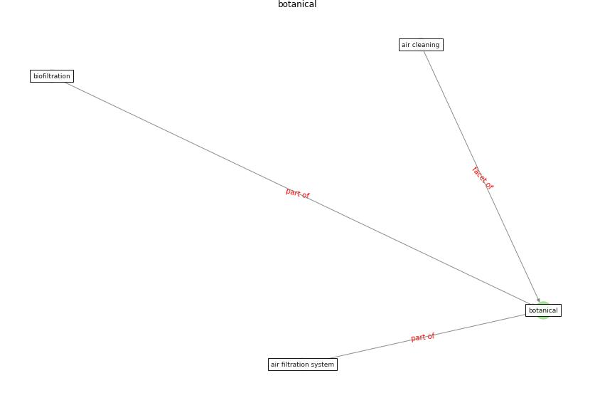

# Keyword: __botanical__
## Clusters

* Cluster 4: [air-formaldehyde](cluster_4)

## Concepts

 

## Articles
* Characterization and performance evaluation of a
full-scale activated carbon-based dynamic botanical air
filtration system for improving indoor air quality ([wang_characterization_2011](article_wang_characterization_2011))
* Indoor Air Quality: Rethinking rules of building
design strategies in post-pandemic architecture ([megahed_indoor_2021](article_megahed_indoor_2021))
* RUDDS_bioRxiv_update ([RUDDS_bioRxiv_update](article_RUDDS_bioRxiv_update))
* DeepSOCIAL: Social Distancing Monitoring and
Infection Risk Assessment in COVID-19 Pandemic ([rezaei_deepsocial_2020](article_rezaei_deepsocial_2020))
* DeepSOCIAL: Social Distancing Monitoring and
Infection Risk Assessment in COVID-19 Pandemic ([rezaei_deepsocial_2020](article_rezaei_deepsocial_2020))
* DeepSOCIAL: Social Distancing Monitoring and
Infection Risk Assessment in COVID-19 Pandemic ([rezaei_deepsocial_2020](article_rezaei_deepsocial_2020))
* DeepSOCIAL: Social Distancing Monitoring and
Infection Risk Assessment in COVID-19 Pandemic ([rezaei_deepsocial_2020](article_rezaei_deepsocial_2020))
* DeepSOCIAL: Social Distancing Monitoring and
Infection Risk Assessment in COVID-19 Pandemic ([rezaei_deepsocial_2020](article_rezaei_deepsocial_2020))
* DeepSOCIAL: Social Distancing Monitoring and
Infection Risk Assessment in COVID-19 Pandemic ([rezaei_deepsocial_2020](article_rezaei_deepsocial_2020))
* DeepSOCIAL: Social Distancing Monitoring and
Infection Risk Assessment in COVID-19 Pandemic ([rezaei_deepsocial_2020](article_rezaei_deepsocial_2020))
