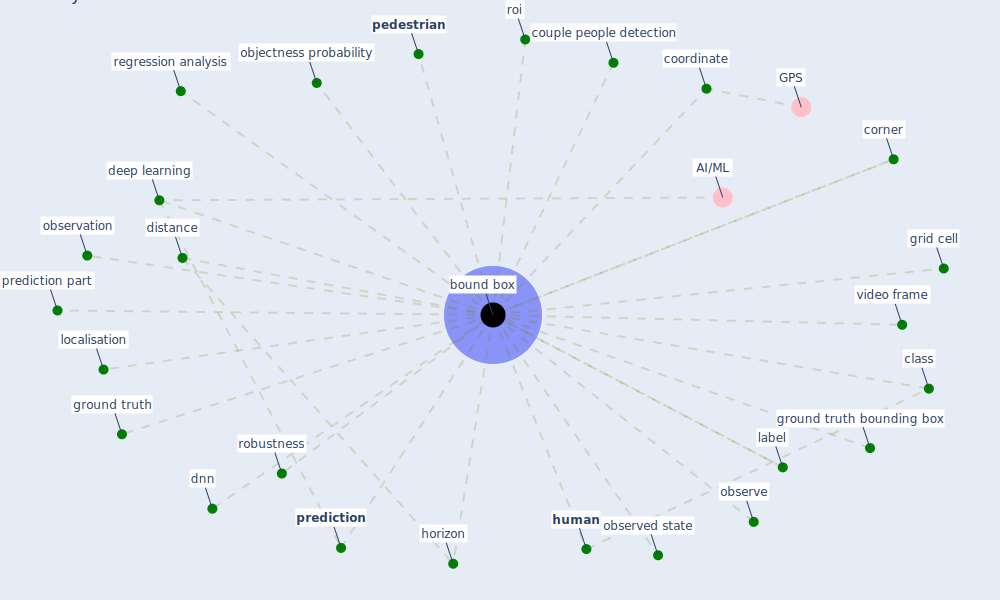

# Keyword: bound box

## Keywords

 * [bound box](keyword_bound_box), bounding box, bounding boxes, class, coordinate, corner, couple people detection, [deep learning](keyword_deep_learning), distance, dnn, grid cell, ground truth, ground truth bounding box, [horizon](keyword_horizon), [human](keyword_human), label, localisation, objectness probability, observation, observe, observed state, [pedestrian](keyword_pedestrian), [prediction](keyword_prediction), prediction part, regression analysis, robustness, roi, video frame

## Mapping

## Neighbours

### Closest articles

* DeepSOCIAL: Social Distancing Monitoring and Infection Risk Assessment in COVID-19 Pandemic - [LINK](article_rezaei_deepsocial_2020)
* Towards the sustainable development of smart cities through mass video surveillance: A response to the COVID-19 pandemic - [LINK](article_shorfuzzaman_towards_2021)
* COVID19-Routes: A Safe Pedestrian Navigation Service - [LINK](article_cantarero_covid19-routes_2021)

### Closest BPs

