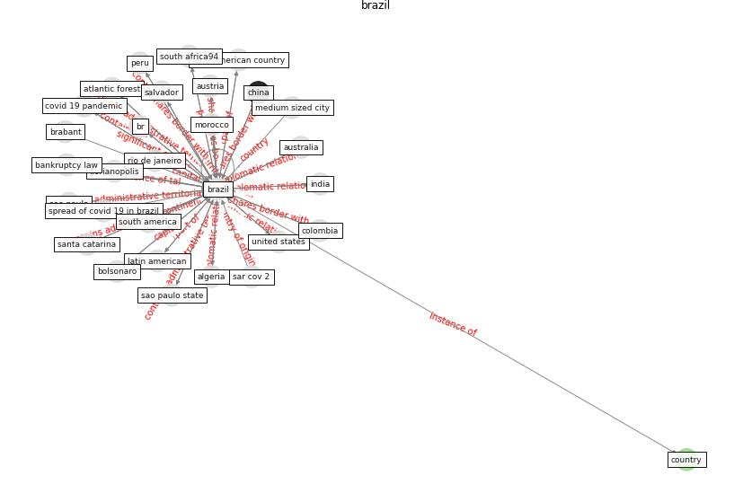

# Keyword: __brazil__

## Concepts

 

## Top articles for __brazil__
* Addressing the impact of COVID-19 lockdown on energy use
in municipal buildings: A case study in Florianópolis,
Brazil ([geraldi_addressing_2021](article_geraldi_addressing_2021))
* COVID-ABS: An agent-based model of COVID-19
epidemic to simulate health and economic effects of social
distancing interventions ([silva_covid-abs_2020](article_silva_covid-abs_2020))
