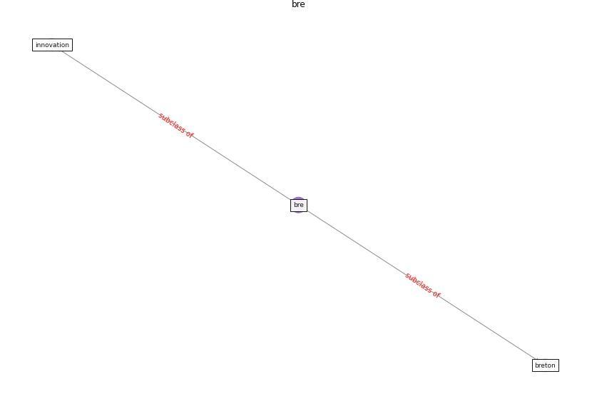

# Keyword: __bre__
## Clusters

* Cluster 6: [building-guidance](cluster_6.md)

## Concepts

 

## Articles
* Assessment method for new sustainability indicators
providing pandemic resilience for residential buildings ([tokazhanov_assessment_2021](article_tokazhanov_assessment_2021.md))
* Navigating Climate Change: Rethinking the Role of
Buildings ([cole_navigating_2020](article_cole_navigating_2020.md))
* RUDDS_bioRxiv_update ([RUDDS_bioRxiv_update](article_RUDDS_bioRxiv_update.md))
* DeepSOCIAL: Social Distancing Monitoring and
Infection Risk Assessment in COVID-19 Pandemic ([rezaei_deepsocial_2020](article_rezaei_deepsocial_2020.md))
* DeepSOCIAL: Social Distancing Monitoring and
Infection Risk Assessment in COVID-19 Pandemic ([rezaei_deepsocial_2020](article_rezaei_deepsocial_2020.md))
* DeepSOCIAL: Social Distancing Monitoring and
Infection Risk Assessment in COVID-19 Pandemic ([rezaei_deepsocial_2020](article_rezaei_deepsocial_2020.md))
* DeepSOCIAL: Social Distancing Monitoring and
Infection Risk Assessment in COVID-19 Pandemic ([rezaei_deepsocial_2020](article_rezaei_deepsocial_2020.md))
* DeepSOCIAL: Social Distancing Monitoring and
Infection Risk Assessment in COVID-19 Pandemic ([rezaei_deepsocial_2020](article_rezaei_deepsocial_2020.md))
* DeepSOCIAL: Social Distancing Monitoring and
Infection Risk Assessment in COVID-19 Pandemic ([rezaei_deepsocial_2020](article_rezaei_deepsocial_2020.md))
* DeepSOCIAL: Social Distancing Monitoring and
Infection Risk Assessment in COVID-19 Pandemic ([rezaei_deepsocial_2020](article_rezaei_deepsocial_2020.md))
