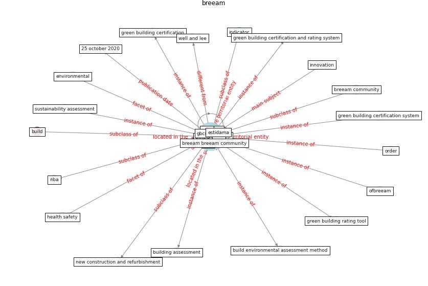

# Keyword: __breeam__
## Clusters

* Cluster 6: [building-guidance](cluster_6.md)

## Concepts

 

## Articles
* How to Make Green Building Certification \&
Rating Systems More Pandemic-Sustainable? ([ujikawa_how_2022](article_ujikawa_how_2022.md))
* Assessment method for new sustainability indicators
providing pandemic resilience for residential buildings ([tokazhanov_assessment_2021](article_tokazhanov_assessment_2021.md))
* Readiness Assessment of Green Building
Certification Systems for Residential Buildings
during Pandemics ([tleuken_readiness_2021](article_tleuken_readiness_2021.md))
* Readiness Assessment of Green Building
Certification Systems for Residential Buildings
during Pandemics ([tleuken_readiness_2021](article_tleuken_readiness_2021.md))
* Navigating Climate Change: Rethinking the Role of
Buildings ([cole_navigating_2020](article_cole_navigating_2020.md))
* Readiness Assessment of Green Building
Certification Systems for Residential Buildings
during Pandemics ([tleuken_readiness_2021](article_tleuken_readiness_2021.md))
* Prophylactic Architecture: Formulating the Concept
of Pandemic-Resilient Homes ([elrayies_prophylactic_2022](article_elrayies_prophylactic_2022.md))
* breeam_covid-19_2020 ([breeam_covid-19_2020](article_breeam_covid-19_2020.md))
* Readiness Assessment of Green Building
Certification Systems for Residential Buildings
during Pandemics ([tleuken_readiness_2021](article_tleuken_readiness_2021.md))
* Readiness Assessment of Green Building
Certification Systems for Residential Buildings
during Pandemics ([tleuken_readiness_2021](article_tleuken_readiness_2021.md))
