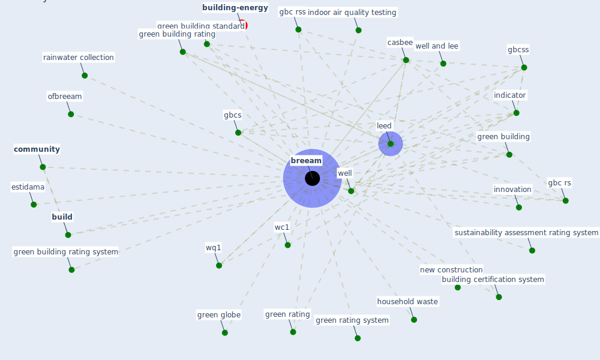

# Keyword: breeam

* [building-energy](cluster_2)

## Keywords

 * Cluster_2, [breeam](keyword_breeam), breeam breeam community, breeam community, brienne, [build](keyword_build), building assessment, building certification system, building type, carbon reduction, casbee, [community](keyword_community), [covid-19](keyword_covid-19), eco friendliness, environmental, estidama, gbc rs, gbc rss, gbcs, [gbcss](keyword_gbcss), [green building](keyword_green_building), green building assessment, green building certification, green building certification and rating system, green building certification system, green building rating, green building rating system, green building rating tool, green building standard, green globe, green rating, green rating system, gsa, health safety, household waste, [indicator](keyword_indicator), [indoor air quality testing](keyword_indoor_air_quality_testing), [innovation](keyword_innovation), [leed](keyword_leed), microclimate, microclimate simulation, minimum good practice standard of space, new construction, new construction and refurbishment, ofbreeam, order, pandemic resilient criterion, [pandemic resilient indicator](keyword_pandemic_resilient_indicator), pandemic response, rainwater collection, riba, [sustainability](keyword_sustainability), sustainability assessment, sustainability assessment rating system, [united kingdom](keyword_united_kingdom), wc1, well, well and lee, wq1

## Mapping

## Neighbours

### Closest articles

* Readiness Assessment of Green Building Certification Systems for Residential Buildings during Pandemics - [LINK](article_tleuken_readiness_2021)
* How to Make Green Building Certification &amp; Rating Systems More Pandemic-Sustainable? - [LINK](article_ujikawa_how_2022)
* Assessment method for new sustainability indicators providing pandemic resilience for residential buildings - [LINK](article_tokazhanov_assessment_2021)
* Assessment of Building Automation and Control Systems in Danish Healthcare Facilities in the COVID-19 Era - [LINK](article_pedersen_assessment_2022)
* Prophylactic Architecture: Formulating the Concept of Pandemic-Resilient Homes - [LINK](article_elrayies_prophylactic_2022)
* COVID-19 Bulletin 1: Alterations to BREEAM assessment requirements as a result of the Coronavirus pandemic – Knowledge Base - [LINK](article_breeam_covid-19_2020)
* Navigating Climate Change: Rethinking the Role of Buildings - [LINK](article_cole_navigating_2020)
* How is COVID-19 Experience Transforming Sustainability Requirements of Residential Buildings? A Review - [LINK](article_tokazhanov_how_2020)
* Health, Wellbeing \& Productivity in Offices - [LINK](article_world_green_building_council_health_2014)
* COVID-19 and Green Housing: A Review of Relevant Literature - [LINK](article_kaklauskas_covid-19_2021)

### Closest BPs

