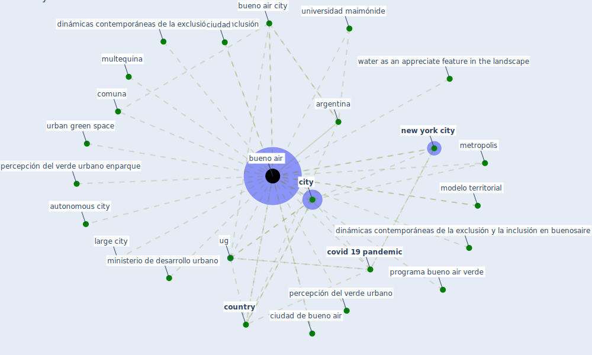

# Keyword: bueno air

## Keywords

 * [argentina](keyword_argentina), autonomous city, [bueno air](keyword_bueno_air), bueno air city, buenos aires, [city](keyword_city), ciudad, ciudad de bueno air, comuna, [country](keyword_country), [covid 19 pandemic](keyword_covid_19_pandemic), dinámicas contemporáneas de la exclusión y la inclusión, dinámicas contemporáneas de la exclusión y la inclusión en buenosaire, large city, metropolis, ministerio de desarrollo urbano, modelo territorial, multequina, [new york city](keyword_new_york_city), percepción del verde urbano, percepción del verde urbano enparque, programa bueno air verde, [ug](keyword_ug), universidad maimónide, [urban green space](keyword_urban_green_space), water as an appreciate feature in the landscape

## Mapping

## Neighbours

### Closest articles

* Green in times of COVID-19: urban green space relevance during the COVID-19 pandemic in Buenos Aires City - [LINK](article_marconi_green_2022)
* The Emergence of Anti-Privacy and Control at the Nexus between the Concepts of Safe City and Smart City - [LINK](article_allam_emergence_2019)
* The Impact of COVID-19 on Public Space: A Review of the Emerging Questions - [LINK](article_honey-roses_impact_2020)

### Closest BPs

