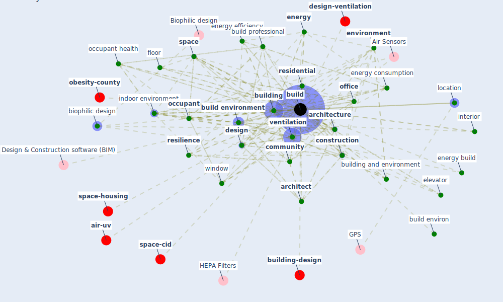

# Keyword: build

* [air-sars](cluster_2)

* [housing-space](cluster_9)

* [building-energy](cluster_14)

## Keywords

 * [apartment](keyword_apartment), [architect](keyword_architect), architectural, [architecture](keyword_architecture), [bacs](keyword_bacs), [balcony](keyword_balcony), [biophilic design](keyword_biophilic_design), [build](keyword_build), build environ, [build environment](keyword_build_environment), build morphology, build professional, [building](keyword_building), building and environment, building design, building environment, building manager, building system, building wall, [case](keyword_case), [case building](keyword_case_building), [city](keyword_city), commercial, [community](keyword_community), [construction](keyword_construction), courtyard, [crowd model](keyword_crowd_model), descriptive analysis, [design](keyword_design), door, elevator, [energy](keyword_energy), energy build, energy con sumption, [energy consumption](keyword_energy_consumption), [energy efficiency](keyword_energy_efficiency), energy use, [engineering](keyword_engineering), entrance, envelope, [environment](keyword_environment), exposure time, façade, flat roof, floor, floor plan, function, [green building](keyword_green_building), [health](keyword_health), [health and safety](keyword_health_and_safety), heating system, high occupancy, [hospital](keyword_hospital), [house](keyword_house), [housing](keyword_housing), [humidity](keyword_humidity), [hvac](keyword_hvac), [indoor](keyword_indoor), [indoor environment](keyword_indoor_environment), [infrastructure](keyword_infrastructure), interior, j j build, lifecycle, live environment, location, maintain, measure impact, neighbourhood, [occupant](keyword_occupant), occupant density, [occupant health](keyword_occupant_health), [office](keyword_office), [organisation](keyword_organisation), [people](keyword_people), [plan](keyword_plan), population density, practitioner, [residential](keyword_residential), [resilience](keyword_resilience), roof, safe building environment, [sample](keyword_sample), [school](keyword_school), [simulation](keyword_simulation), [space](keyword_space), [surface](keyword_surface), [sustainability](keyword_sustainability), sustainable building, [system](keyword_system), theory, type, urban area, vehicle, [ventilation](keyword_ventilation), ventilation rate, ventilation system, water system, [window](keyword_window), work hour, [workplace](keyword_workplace)

## Mapping

## Neighbours

### Closest articles

* Occupant health in buildings: Impact of the COVID-19 pandemic on the opinions of building professionals and implications on research - [LINK](article_awada_occupant_2022)
* Health, Wellbeing \& Productivity in Offices - [LINK](article_world_green_building_council_health_2014)
* Ten questions concerning occupant health in buildings during normal operations and extreme events including the COVID-19 pandemic - [LINK](article_awada_ten_2021)
* The effect of occupant distribution on energy consumption and COVID-19 infection in buildings: A case study of university building - [LINK](article_mokhtari_effect_2021)
* Assessment of Building Automation and Control Systems in Danish Healthcare Facilities in the COVID-19 Era - [LINK](article_pedersen_assessment_2022)
* A review of facilities management interventions to mitigate respiratory infections in existing buildings - [LINK](article_zhang_review_2022)
* Designing Post COVID-19 Buildings: Approaches for Achieving Healthy Buildings - [LINK](article_navaratnam_designing_2022)
* COVID-19 Could Leverage a Sustainable Built Environment - [LINK](article_pinheiro_covid-19_2020)
* Continuous IEQ monitoring system: Context and development - [LINK](article_parkinson_continuous_2019)
* A Review on Building Design as a Biomedical System for Preventing COVID-19 Pandemic - [LINK](article_amran_review_2022)

### Closest BPs

