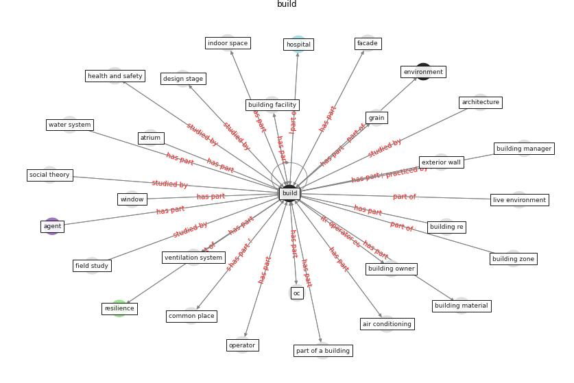

# Keyword: __build__
## Clusters

* Cluster 5: [space-flexible](cluster_5)
* Cluster 7: [building-space](cluster_7)
* Cluster 9: [resilience-infrastructure](cluster_9)

## Concepts

 

## Articles
* Ten questions concerning occupant health in buildings
during normal operations and extreme events including the
COVID-19 pandemic ([awada_ten_2021](article_awada_ten_2021))
* The effect of occupant distribution on energy consumption
and COVID-19 infection in buildings: A case study of
university building ([mokhtari_effect_2021](article_mokhtari_effect_2021))
* Designing Post COVID-19 Buildings: Approaches for
Achieving Healthy Buildings ([navaratnam_designing_2022](article_navaratnam_designing_2022))
* Continuous IEQ monitoring system: Context and
development ([parkinson_continuous_2019](article_parkinson_continuous_2019))
* A Review on Building Design as a Biomedical
System for Preventing COVID-19 Pandemic ([amran_review_2022](article_amran_review_2022))
* A Global Survey of Infection Control and
Mitigation Measures for Combating the Transmission
of COVID-19 Pandemic in Buildings Under
Facilities Management Services ([sarvari_global_2022](article_sarvari_global_2022))
* Navigating Climate Change: Rethinking the Role of
Buildings ([cole_navigating_2020](article_cole_navigating_2020))
* p15-lee-vor ([p15-lee-vor](article_p15-lee-vor))
* Addressing the impact of COVID-19 lockdown on energy use
in municipal buildings: A case study in Florianópolis,
Brazil ([geraldi_addressing_2021](article_geraldi_addressing_2021))
* Towards Resilient Residential Buildings and
Neighborhoods in Light of COVID-19 Pandemic—The
Scenario of Podgorica, Montenegro ([bojovic_towards_2022](article_bojovic_towards_2022))
