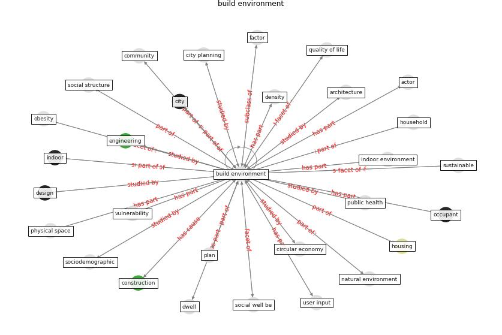

# Keyword: __build environment__

## Concepts

 

## Top articles for __build environment__
* Adaptive Design of the Built Environment to
Mitigate the Transmission Risk of COVID-19 ([ara_dilshad_shangi_adaptive_2020](article_ara_dilshad_shangi_adaptive_2020))
* Revisiting the built environment: 10 potential development
changes and paradigm shifts due to COVID-19 ([cheshmehzangi_revisiting_2021](article_cheshmehzangi_revisiting_2021))
* Treating two pandemics for the price of one: Chronic and
infectious disease impacts of the built and natural
environment ([frank_treating_2021](article_frank_treating_2021))
* yan_10_2020 ([yan_10_2020](article_yan_10_2020))
* Architectural Design Drives the Biogeography of
Indoor Bacterial Communities ([kembel_architectural_2014](article_kembel_architectural_2014))
* Designing a Multi-Agent Occupant Simulation
System to Support Facility Planning and Analysis
for COVID-19 ([lee_designing_2021](article_lee_designing_2021))
* Antivirus-built environment: Lessons learned from
Covid-19 pandemic ([megahed_antivirus-built_2020](article_megahed_antivirus-built_2020))
* yan_10_2020 ([yan_10_2020](article_yan_10_2020))
* COVID-19 Could Leverage a Sustainable Built
Environment ([pinheiro_covid-19_2020](article_pinheiro_covid-19_2020))
