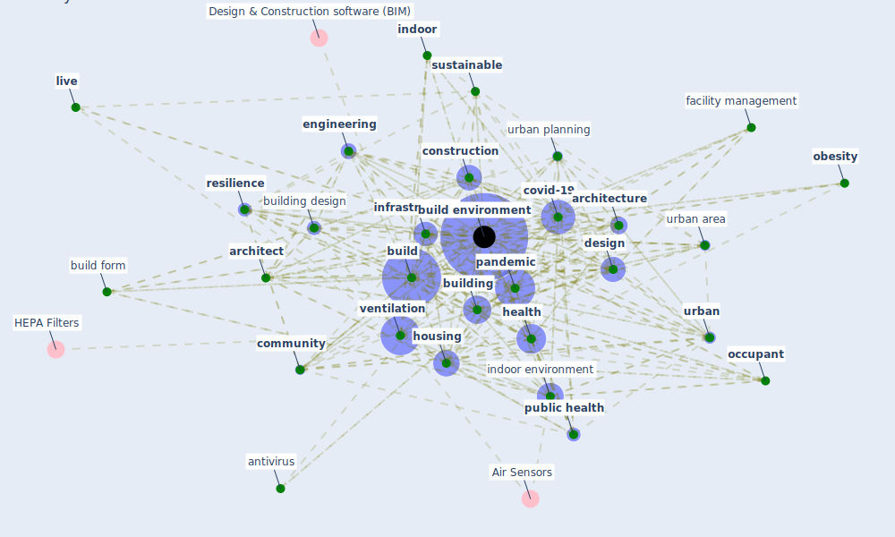

# Keyword: build environment

## Keywords

 * 70 d, actor, antivirus, [architect](keyword_architect), [architecture](keyword_architecture), [biogeography](keyword_biogeography), [build](keyword_build), build code, build dust, [build environment](keyword_build_environment), build form, build space, [building](keyword_building), building design, building factor, building material, built tamadrahealth, [china](keyword_china), circular business model, [circular economy](keyword_circular_economy), [city](keyword_city), city be plan, city planning, [climate change](keyword_climate_change), [community](keyword_community), [construction](keyword_construction), construction management, construction project, control and mitigation, control environment, covariate, [covid 19 pandemic](keyword_covid_19_pandemic), [covid-19](keyword_covid-19), [density](keyword_density), [design](keyword_design), design phase, [dwell](keyword_dwell), ebd, [ecosystem](keyword_ecosystem), [engineering](keyword_engineering), extended period, [facility management](keyword_facility_management), [factor](keyword_factor), frontier, function, [green space](keyword_green_space), habitat, [health](keyword_health), [home](keyword_home), [household](keyword_household), [housing](keyword_housing), housing condition, human being, human building interaction, hypothe size, [ibem](keyword_ibem), [indoor](keyword_indoor), indoor ecosystem, [indoor environment](keyword_indoor_environment), indoor fluid in environment, indoor space, [infrastructure](keyword_infrastructure), intersection density, knowledge management, lifestyle, light and health, [live](keyword_live), microbiological, microbiome, [nature](keyword_nature), [neighborhood](keyword_neighborhood), [obesity](keyword_obesity), [occupant](keyword_occupant), [pandemic](keyword_pandemic), [people](keyword_people), [physical](keyword_physical), [plan](keyword_plan), planner, poor housing, post architecture, production, professional opinion, [public health](keyword_public_health), [public space](keyword_public_space), [resilience](keyword_resilience), sciencedirect, structural, [surface](keyword_surface), [sustainability](keyword_sustainability), [sustainable](keyword_sustainable), trade, train, transmission risk, [urban](keyword_urban), urban area, [urban planning](keyword_urban_planning), use pattern, user input, [ventilation](keyword_ventilation), [vulnerability](keyword_vulnerability)

## Mapping

## Neighbours

### Closest articles

* Adaptive Design of the Built Environment to Mitigate the Transmission Risk of COVID-19 - [LINK](article_ara_dilshad_shangi_adaptive_2020)
* COVID-19 Could Leverage a Sustainable Built Environment - [LINK](article_pinheiro_covid-19_2020)
* Revisiting the built environment: 10 potential development changes and paradigm shifts due to COVID-19 - [LINK](article_cheshmehzangi_revisiting_2021)
* Treating two pandemics for the price of one: Chronic and infectious disease impacts of the built and natural environment - [LINK](article_frank_treating_2021)
* Antivirus-built environment: Lessons learned from Covid-19 pandemic - [LINK](article_megahed_antivirus-built_2020)
* Decision Making within the Built Environment as a Strategy for Mitigating the Risk of Malaria and Other Vector-Borne Diseases - [LINK](article_obonyo_decision_2018)
* Association of built environment attributes with the spread of COVID-19 at its initial stage in China - [LINK](article_li_association_2021)
* Navigating Climate Change: Rethinking the Role of Buildings - [LINK](article_cole_navigating_2020)
* Architectural Design Drives the Biogeography of Indoor Bacterial Communities - [LINK](article_kembel_architectural_2014)
* Designing a Multi-Agent Occupant Simulation System to Support Facility Planning and Analysis for COVID-19 - [LINK](article_lee_designing_2021)

### Closest BPs

