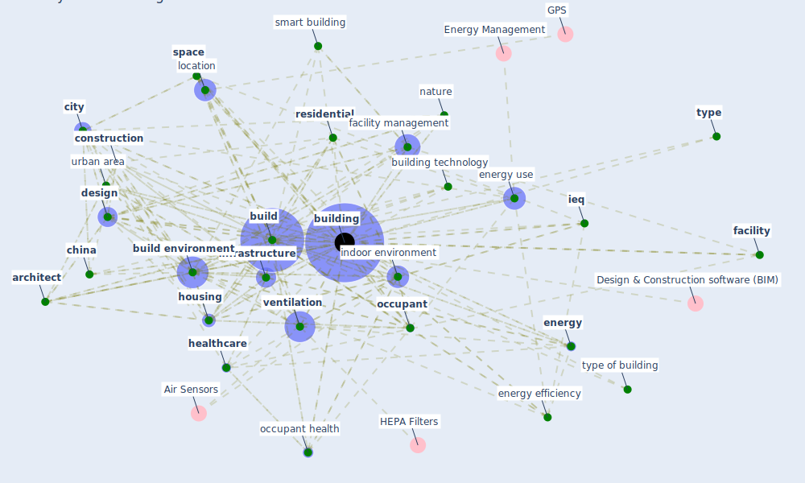

# Keyword: building

## Keywords

 * acoustic, airphx, [architect](keyword_architect), [architecture](keyword_architecture), [area](keyword_area), automation and control, automobile, [build](keyword_build), [build environment](keyword_build_environment), [building](keyword_building), building technology, campus, [china](keyword_china), [city](keyword_city), complex, compound, concrete, [construction](keyword_construction), construction sector, contact surface, [coronavirus](keyword_coronavirus), [design](keyword_design), [domain](keyword_domain), electric energy, [energy](keyword_energy), [energy consumption](keyword_energy_consumption), [energy efficiency](keyword_energy_efficiency), energy efficient, energy performance, energy use, energy use in building, fa cility, facility, [facility management](keyword_facility_management), façade, finance, flat roof, functionally, future of building, [green building](keyword_green_building), [health](keyword_health), health challenge, [healthcare](keyword_healthcare), healthcare building, heating ventilating and air conditioning system, high rise, high risk building, [home](keyword_home), [hospital](keyword_hospital), [housing](keyword_housing), humansafe uv radiation intensity, [ieq](keyword_ieq), [impact](keyword_impact), indoor air, [indoor environment](keyword_indoor_environment), infiltration, infrastructural, [infrastructure](keyword_infrastructure), isolation, location, low risk, measurement, method, method classification, microbiome, naturally ventilate, [nature](keyword_nature), new innovative solution, [noise](keyword_noise), non domestic, [occupant](keyword_occupant), occupant behavior, [occupant exposure](keyword_occupant_exposure), [occupant health](keyword_occupant_health), open space, operation, other assets, outdoor air, perception, [pollutant](keyword_pollutant), [professional](keyword_professional), residence, [residential](keyword_residential), [smart building](keyword_smart_building), [solution](keyword_solution), [space](keyword_space), space and building, specific, streetscape, [sustainable architecture](keyword_sustainable_architecture), [system](keyword_system), [technology](keyword_technology), [transmission](keyword_transmission), type, type of building, urban area, urban design, urban fabric, [ventilation](keyword_ventilation), ventilation system

## Mapping

## Neighbours

### Closest articles

* A Global Survey of Infection Control and Mitigation Measures for Combating the Transmission of COVID-19 Pandemic in Buildings Under Facilities Management Services - [LINK](article_sarvari_global_2022)
* Addressing the impact of COVID-19 lockdown on energy use in municipal buildings: A case study in Florianópolis, Brazil - [LINK](article_geraldi_addressing_2021)
* Occupant health in buildings: Impact of the COVID-19 pandemic on the opinions of building professionals and implications on research - [LINK](article_awada_occupant_2022)
* COVID-19 Could Leverage a Sustainable Built Environment - [LINK](article_pinheiro_covid-19_2020)
* Designing Post COVID-19 Buildings: Approaches for Achieving Healthy Buildings - [LINK](article_navaratnam_designing_2022)
* Ten questions concerning occupant health in buildings during normal operations and extreme events including the COVID-19 pandemic - [LINK](article_awada_ten_2021)
* Health, Wellbeing \& Productivity in Offices - [LINK](article_world_green_building_council_health_2014)
* An Intelligent IEQ Monitoring and Feedback System: Development and Applications - [LINK](article_geng_intelligent_2021)
* Navigating Climate Change: Rethinking the Role of Buildings - [LINK](article_cole_navigating_2020)
* A Review on Building Design as a Biomedical System for Preventing COVID-19 Pandemic - [LINK](article_amran_review_2022)

### Closest BPs

