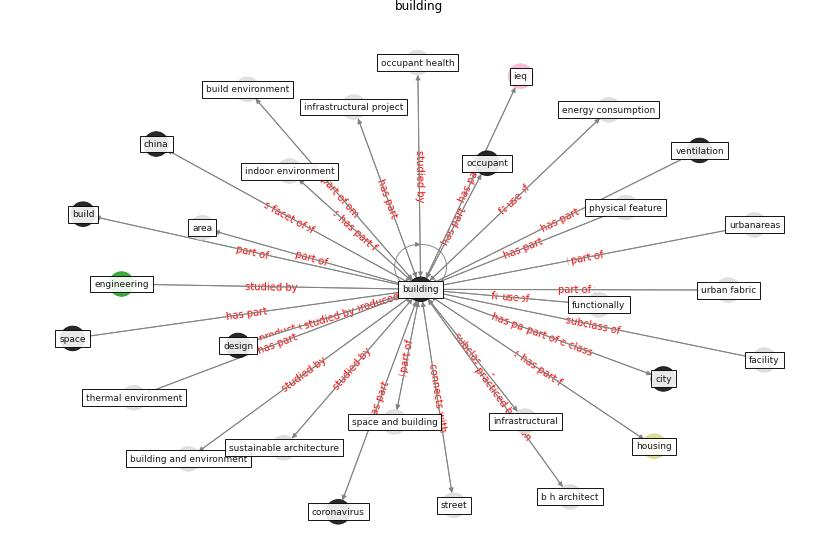

# Keyword: __building__
## Clusters

* Cluster 2: [construction-resilience](cluster_2)
* Cluster 4: [air-formaldehyde](cluster_4)
* Cluster 5: [space-flexible](cluster_5)
* Cluster 6: [building-guidance](cluster_6)
* Cluster 7: [building-space](cluster_7)
* Cluster 8: [air-ventilation](cluster_8)

## Concepts

 

## Articles
* A Global Survey of Infection Control and
Mitigation Measures for Combating the Transmission
of COVID-19 Pandemic in Buildings Under
Facilities Management Services ([sarvari_global_2022](article_sarvari_global_2022))
* Addressing the impact of COVID-19 lockdown on energy use
in municipal buildings: A case study in Florianópolis,
Brazil ([geraldi_addressing_2021](article_geraldi_addressing_2021))
* Designing Post COVID-19 Buildings: Approaches for
Achieving Healthy Buildings ([navaratnam_designing_2022](article_navaratnam_designing_2022))
* Ten questions concerning occupant health in buildings
during normal operations and extreme events including the
COVID-19 pandemic ([awada_ten_2021](article_awada_ten_2021))
* A Global Survey of Infection Control and
Mitigation Measures for Combating the Transmission
of COVID-19 Pandemic in Buildings Under
Facilities Management Services ([sarvari_global_2022](article_sarvari_global_2022))
* An Intelligent IEQ Monitoring and Feedback
System: Development and Applications ([geng_intelligent_2021](article_geng_intelligent_2021))
* A Review on Building Design as a Biomedical
System for Preventing COVID-19 Pandemic ([amran_review_2022](article_amran_review_2022))
* Navigating Climate Change: Rethinking the Role of
Buildings ([cole_navigating_2020](article_cole_navigating_2020))
* realdania_refleksioner_2022_EN ([realdania_refleksioner_2022_EN](article_realdania_refleksioner_2022_EN))
* Occupant health in buildings: Impact of the COVID-19
pandemic on the opinions of building professionals and
implications on research ([awada_occupant_2022](article_awada_occupant_2022))
