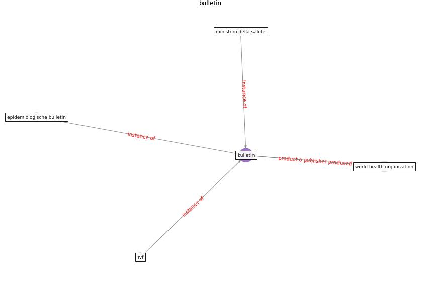

# Keyword: __bulletin__
## Clusters

* Cluster 6: [building-guidance](cluster_6.md)

## Concepts

 

## Articles
* First detection of SARS-CoV-2 in untreated wastewaters
in Italy ([la_rosa_first_2020](article_la_rosa_first_2020.md))
* Methods for air cleaning and protection of building
occupants from airborne pathogens ([bolashikov_methods_2009](article_bolashikov_methods_2009.md))
* What has been the impact of the COVID-19 pandemic on
immigrants? An update on recent evidence ([oecd_what_2022](article_oecd_what_2022.md))
* martin_impact_2008 ([martin_impact_2008](article_martin_impact_2008.md))
* RUDDS_bioRxiv_update ([RUDDS_bioRxiv_update](article_RUDDS_bioRxiv_update.md))
* DeepSOCIAL: Social Distancing Monitoring and
Infection Risk Assessment in COVID-19 Pandemic ([rezaei_deepsocial_2020](article_rezaei_deepsocial_2020.md))
* DeepSOCIAL: Social Distancing Monitoring and
Infection Risk Assessment in COVID-19 Pandemic ([rezaei_deepsocial_2020](article_rezaei_deepsocial_2020.md))
* DeepSOCIAL: Social Distancing Monitoring and
Infection Risk Assessment in COVID-19 Pandemic ([rezaei_deepsocial_2020](article_rezaei_deepsocial_2020.md))
* DeepSOCIAL: Social Distancing Monitoring and
Infection Risk Assessment in COVID-19 Pandemic ([rezaei_deepsocial_2020](article_rezaei_deepsocial_2020.md))
* DeepSOCIAL: Social Distancing Monitoring and
Infection Risk Assessment in COVID-19 Pandemic ([rezaei_deepsocial_2020](article_rezaei_deepsocial_2020.md))
