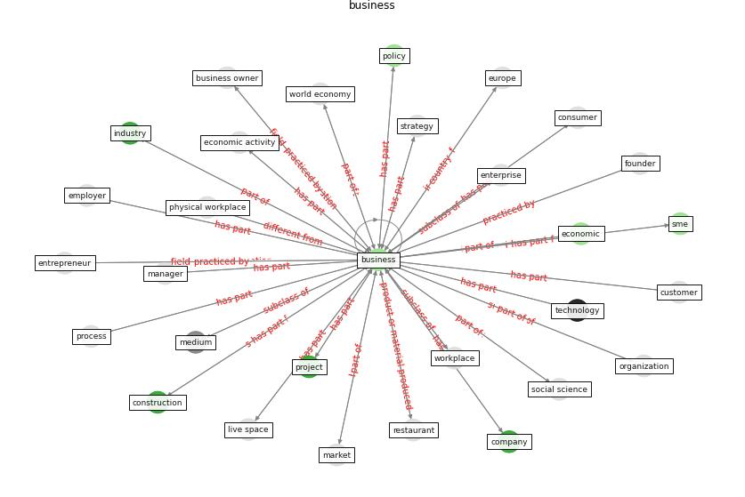

# Keyword: __business__
## Clusters

* Cluster 14: [surveying-drone](cluster_14.md)

## Concepts

 

## Articles
* COVID19: Small and medium enterprises challenges and
responses with creativity, innovation, and
entrepreneurship ([thukral_covid19_2021](article_thukral_covid19_2021.md))
* realdania_refleksioner_2022_EN ([realdania_refleksioner_2022_EN](article_realdania_refleksioner_2022_EN.md))
* Startups in times of crisis – A rapid response to the
COVID-19 pandemic ([kuckertz_startups_2020](article_kuckertz_startups_2020.md))
* Retail Signage During the COVID-19 Pandemic ([mcneish_retail_2020](article_mcneish_retail_2020.md))
* world_green_building_council_health_2014-50 ([world_green_building_council_health_2014-50](article_world_green_building_council_health_2014-50.md))
* Mechanisms for addressing the impact of COVID-19 on
infrastructure projects ([king_mechanisms_2021](article_king_mechanisms_2021.md))
* Mapping research in logistics and supply chain management
during COVID-19 pandemic ([montoya-torres_mapping_2021](article_montoya-torres_mapping_2021.md))
* nassereddine_propositions_2021 ([nassereddine_propositions_2021](article_nassereddine_propositions_2021.md))
* Strategies to Mitigate COVID-19 Pandemic Impacts
on Health and Safety of Workers in Construction
Projects ([kaushal_strategies_2021](article_kaushal_strategies_2021.md))
* COVID-ABS: An agent-based model of COVID-19
epidemic to simulate health and economic effects of social
distancing interventions ([silva_covid-abs_2020](article_silva_covid-abs_2020.md))
