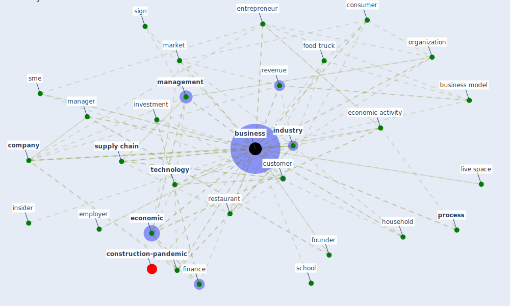

# Keyword: business

* [construction-pandemic](cluster_1)

## Keywords

 * at t, [bank](keyword_bank), banking, bbc, [business](keyword_business), business community, business contact, business model, business owner, business strategy, citizen, [company](keyword_company), competitor, [construction](keyword_construction), consulting service, [consumer](keyword_consumer), consumer behavior, consumer segment, [contract](keyword_contract), culture, [customer](keyword_customer), datum collection, [economic](keyword_economic), economic activity, [employer](keyword_employer), enterprise, [entrepreneur](keyword_entrepreneur), ethic, [europe](keyword_europe), family, finance, financial, food truck, founder, [government](keyword_government), grocery store, guest experience, hair salon, health and safety risk, [hospital](keyword_hospital), hospitality, [household](keyword_household), individual, [indoor air quality](keyword_indoor_air_quality), [industry](keyword_industry), information management, [infrastructure](keyword_infrastructure), [innovation](keyword_innovation), insider, interest, investment, live space, livelihood, loan, manage project, [management](keyword_management), [manager](keyword_manager), [manufacture](keyword_manufacture), market, [medium](keyword_medium), message, online retailer, [organisation](keyword_organisation), organization, output, personal, [perspective](keyword_perspective), persuasive communication, [policy](keyword_policy), [population](keyword_population), [process](keyword_process), [productivity](keyword_productivity), [project](keyword_project), public sector, rapport, reputation, [research](keyword_research), [resilience](keyword_resilience), restaurant, restaurant association, restaurateur, retail, retail store, revenue, [risk](keyword_risk), [school](keyword_school), service industry, servicescape, [sign](keyword_sign), small business, [sme](keyword_sme), [society](keyword_society), [startup](keyword_startup), strategy, [supply chain](keyword_supply_chain), sustainable business, [technology](keyword_technology), woman own business, [workplace](keyword_workplace), world economy

## Mapping

## Neighbours

### Closest articles

* How COVID-19 Could Accelerate the Adoption of New Retail Technologies and Enhance the (E-)Servicescape - [LINK](article_willems_how_2021)
* World Bank Development Report - [LINK](article_world_bank_world_2022)
* Health, Wellbeing \& Productivity in Offices - [LINK](article_world_green_building_council_health_2014)
* <scp>COVID</scp>             ‐19: Small and medium enterprises challenges and responses with creativity, innovation, and entrepreneurship - [LINK](article_thukral_covid19_2021)
* A study on office workplace modification during the COVID-19 pandemic in The Netherlands - [LINK](article_hou_study_2021)
* A critical analysis of the impacts of COVID-19 on the global economy and ecosystems and opportunities for circular economy strategies - [LINK](article_ibn-mohammed_critical_2021)
* Startups in times of crisis – A rapid response to the COVID-19 pandemic - [LINK](article_kuckertz_startups_2020)
* COVID-ABS: An agent-based model of COVID-19 epidemic to simulate health and economic effects of social distancing interventions - [LINK](article_silva_covid-abs_2020)
* Retail Signage During the COVID-19 Pandemic - [LINK](article_mcneish_retail_2020)
* Mechanisms for addressing the impact of COVID-19 on infrastructure projects - [LINK](article_king_mechanisms_2021)

### Closest BPs

