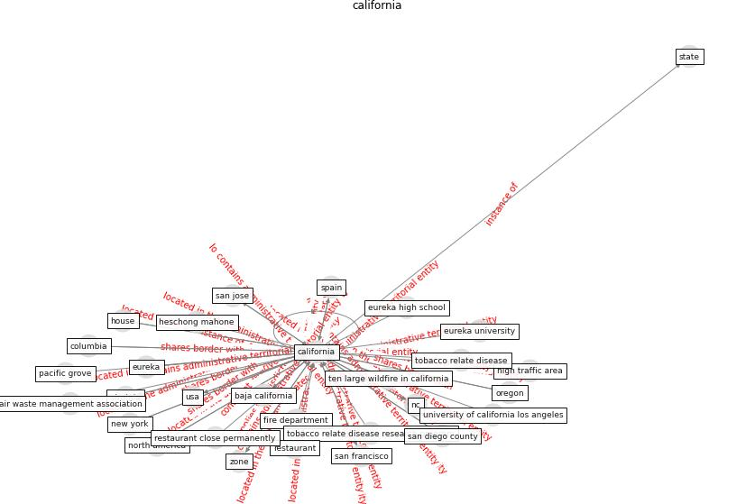

# Keyword: __california__
## Clusters

* Cluster 4: [air-formaldehyde](cluster_4)

## Concepts

 

## Articles
* The Effect of Opening Windows on Air Change
Rates in Two Homes ([howard-reed_effect_2002](article_howard-reed_effect_2002))
* When the fourth water and digital revolution encountered
COVID-19 ([poch_when_2020](article_poch_when_2020))
* COVID-19 and its Modes of Transmission ([karia_covid-19_2020](article_karia_covid-19_2020))
* p15-lee-vor-400 ([p15-lee-vor-400](article_p15-lee-vor-400))
* A Comprehensive Review of the COVID-19 Pandemic
and the Role of IoT, Drones, AI, Blockchain, and
5G in Managing its Impact ([chamola_comprehensive_2020](article_chamola_comprehensive_2020))
* Effects to Construction Project Management
Impacted Circular Economic of Covid-19 Pandemic ([paikan_effects_2021](article_paikan_effects_2021))
* hmc_architects_how_2020-0 ([hmc_architects_how_2020-0](article_hmc_architects_how_2020-0))
* oecd_guidelines_2014 ([oecd_guidelines_2014](article_oecd_guidelines_2014))
* pricewaterhousecoopers_its_2021-0 ([pricewaterhousecoopers_its_2021-0](article_pricewaterhousecoopers_its_2021-0))
* Ten questions concerning occupant health in buildings
during normal operations and extreme events including the
COVID-19 pandemic ([awada_ten_2021](article_awada_ten_2021))
