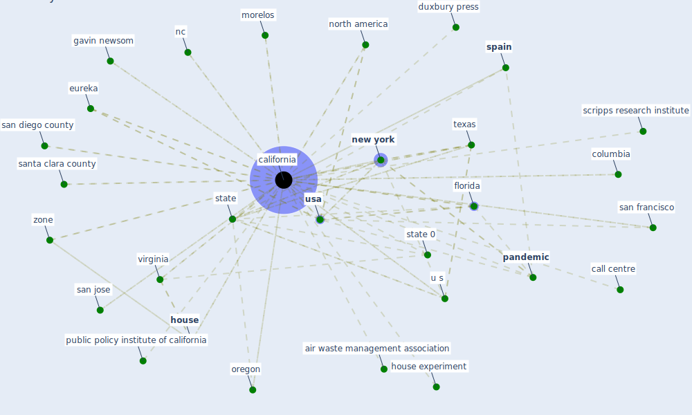

# Keyword: california

## Keywords

 * air waste management association, b k monitor, baja california, [california](keyword_california), call centre, columbia, [coronavirus](keyword_coronavirus), duxbury press, eureka, eureka high school, eureka university, fire department, florida, gavin newsom, [government](keyword_government), governor, heschong mahone, high traffic area, [house](keyword_house), house den, house experiment, howard reed, howard reed wallace and ott, langan, loma prieta, morelos, morelos county, nc, [new york](keyword_new_york), [north america](keyword_north_america), oregon, own state department for worker safety, pacific grove, [pandemic](keyword_pandemic), public policy institute, public policy institute of california, restaurant, restaurant close permanently, same treatment, san diego county, san francisco, san jose, santa clara county, santa cruz, scripps research institute, southern, [spain](keyword_spain), stanford university, [state](keyword_state), state 0, state department, state department for worker safety, ten large wildfire in california, [texas](keyword_texas), the pandemic, the same treatment, tobacco relate disease, tobacco relate disease research program, two state, u s, university of california los angeles, [usa](keyword_usa), [virginia](keyword_virginia), west nile virus, zone

## Mapping

## Neighbours

### Closest articles

* The Effect of Opening Windows on Air Change Rates in Two Homes - [LINK](article_howard-reed_effect_2002)
* Designing a Multi-Agent Occupant Simulation System to Support Facility Planning and Analysis for COVID-19 - [LINK](article_lee_designing_2021)
* Mitigation strategies and compliance in the COVID-19 fight; how much compliance is enough? - [LINK](article_mukerjee_mitigation_2021)
* Compliance with COVID-19 Mitigation Measures in the United States - [LINK](article_van_rooij_compliance_2020)
* Impacts of COVID-19 on residential building energy use and performance - [LINK](article_kawka_impacts_2021)
* How COVID-19 Could Accelerate the Adoption of New Retail Technologies and Enhance the (E-)Servicescape - [LINK](article_willems_how_2021)
* The efficacy of social distance and ventilation effectiveness in preventing COVID-19 transmission - [LINK](article_sun_efficacy_2020)
* The Intelligent Lockdown: Compliance with COVID-19 Mitigation Measures in the Netherlands - [LINK](article_kuiper_intelligent_2020)
* The Impact of COVID-19 on Public Space: A Review of the Emerging Questions - [LINK](article_honey-roses_impact_2020)
* Ten questions concerning occupant health in buildings during normal operations and extreme events including the COVID-19 pandemic - [LINK](article_awada_ten_2021)

### Closest BPs

