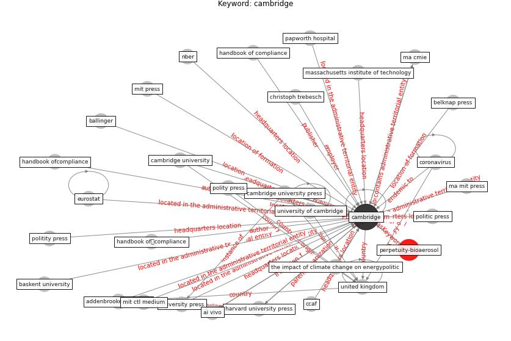

# Keyword: cambridge

* [perpetuity-bioaerosol](cluster_Cluster_3)

## Keywords

 * Cluster_3, addenbrooke s hospital, ai vivo, ballinger, baskent university, belknap press, [cambridge](keyword_cambridge), cambridge university, cambridge university press, ccaf, christoph trebesch, [coronavirus](keyword_coronavirus), eclipse research, eurostat, genewiz, handbook of compliance, handbook ofcompliance, handbook ofボcompliance, handbook ofポcompliance, harvard university press, ma cmie, ma mit press, massachusetts institute, massachusetts institute of technology, mit ctl medium, mit press, nber, papworth hospital, politic press, politity press, polity press, the impact of climate change on energypolitic, [united kingdom](keyword_united_kingdom), university of cambridge, university press

## Concepts

 

## Neighbours

### Closest articles

* World Bank Development Report - [LINK](article_world_bank_world_2022)
* Addressing vulnerability, building resilience: community-based adaptation to vector-borne diseases in the context of global change - [LINK](article_bardosh_addressing_2017)
* The Intelligent Lockdown: Compliance with COVID-19 Mitigation Measures in the Netherlands - [LINK](article_kuiper_intelligent_2020)
* Covid-19 and the politics of sustainable energy transitions - [LINK](article_kuzemko_covid-19_2020)
* Biophilic design in architecture and its contributions to health, well-being, and sustainability: A critical review - [LINK](article_zhong_biophilic_2022)
* The Impact of COVID-19 on Public Space: A Review of the Emerging Questions - [LINK](article_honey-roses_impact_2020)
* The impact of climate change on the epidemiology and control of Rift Valley fever - PubMed - [LINK](article_martin_impact_2008)
* Coronavirus questions that will not go away: interrogating urban and socio-spatial implications of COVID-19 measures - [LINK](article_salama_coronavirus_2020)
* How COVID-19 Could Accelerate the Adoption of New Retail Technologies and Enhance the (E-)Servicescape - [LINK](article_willems_how_2021)
* Strengthening resilience: a priority shared by Health 2020 and - [LINK](article_who_strengthening_2017)

### Closest BPs

