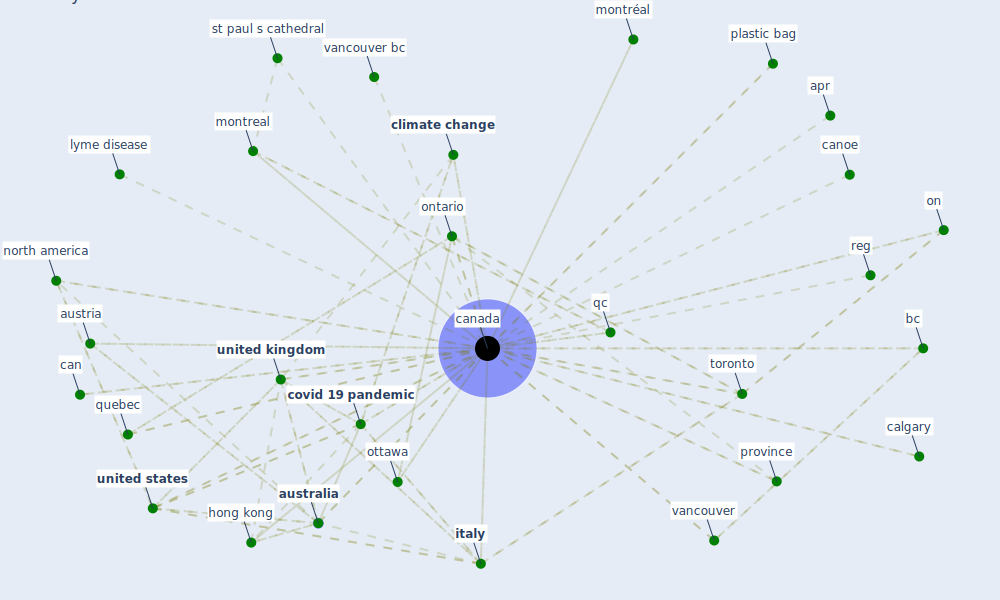

# Keyword: canada

## Keywords

 * apr, [australia](keyword_australia), [austria](keyword_austria), bc, build code, calgary, can, [canada](keyword_canada), canada subj toronto, canadian, canadian grocer, canoe, cbc news, census in brief dwelling in canada, census recensement, cent, [china](keyword_china), cigarette advertising, civil aviation activity, [climate change](keyword_climate_change), [coronavirus](keyword_coronavirus), [country](keyword_country), country to country, [covid 19 pandemic](keyword_covid_19_pandemic), covid 19 response, covid 19coronavirus pandemic in canada, [covid-19](keyword_covid-19), cpp, credit constraint, credit constraint and productivity of sme, downtown toronto, draganfly, drink water, drink water in canada, drought, emerging vector borne zoonotic diseases of public health importance in canada, federal, first nation, [france](keyword_france), hcw, [hong kong](keyword_hong_kong), [immigrant](keyword_immigrant), inst inst, [italy](keyword_italy), lake champlain, location pattern, lyme disease, main mall, main mall vancouver, mb, ministry of public safety and solicitor general, mississauga, montreal, montréal, [netherland](keyword_netherland), new society, new society publisher, niagara fall, [north america](keyword_north_america), on, ontario, ottawa, [pandemic](keyword_pandemic), plastic bag, [province](keyword_province), [public health](keyword_public_health), public health agency, public health department, qc, quebec, quill, radio shack, random house, random house of canada, reg, regina, second generation anticoagulant rodenticides in predatory birds, simon fraser university, solicitor general, st pancras, st paul, st paul s cathedral, statcan, supreme court of canada, [switzerland](keyword_switzerland), [toronto](keyword_toronto), toronto on, trudeau, u s, [united kingdom](keyword_united_kingdom), [united states](keyword_united_states), university grants commission, university of ottawa, university of toronto, university of western ontario, uottawa, vancouver, vancouver bc, vietnam, [washington dc](keyword_washington_dc)

## Mapping

## Neighbours

### Closest articles

* Retail Signage During the COVID-19 Pandemic - [LINK](article_mcneish_retail_2020)
* What has been the impact of the COVID-19 pandemic on immigrants? An update on recent evidence - [LINK](article_oecd_what_2022)
* How our homes impact our health: using a COVID-19 informed approach to examine urban apartment housing - [LINK](article_peters_how_2020)
* The Impact of COVID-19 on Public Space: A Review of the Emerging Questions - [LINK](article_honey-roses_impact_2020)
* The City Under COVID‐19: Podcasting As Digital Methodology - [LINK](article_rogers_city_2020)
*  - [LINK](article_mehtab_alam_role_2021)
* A Comprehensive Review of the COVID-19 Pandemic and the Role of IoT, Drones, AI, Blockchain, and 5G in Managing its Impact - [LINK](article_chamola_comprehensive_2020)
* Association of built environment attributes with the spread of COVID-19 at its initial stage in China - [LINK](article_li_association_2021)
* How COVID-19 Could Accelerate the Adoption of New Retail Technologies and Enhance the (E-)Servicescape - [LINK](article_willems_how_2021)
* Psychological Effects of Home Confinement and Social Distancing Derived from COVID-19 in the General Population—A Systematic Review - [LINK](article_rodriguez-fernandez_psychological_2021)

### Closest BPs

